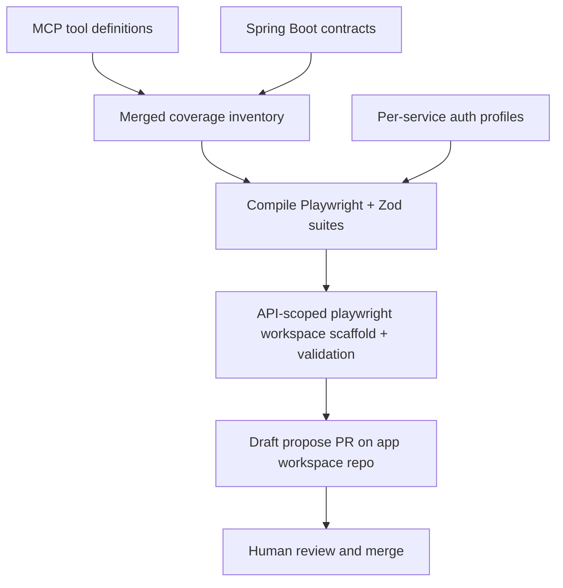

# API Automation Factory - Plan

## Goal Capsule

- **Objective:** Build a compile-first factory that turns MCP tool surfaces plus Spring Boot API contracts into deterministic Playwright suites (HTTP + live MCP calls) with Zod validation, proposed only via human-reviewed PRs into each **app workspace repo**, designed to scale across the API ecosystem without housing production suites in the agent/factory repo.
- **Product authority:** This plan owns the automation factory product shape (inventory model, emit behavior, trust model, coverage definition, **suite landing home**). Target Spring Boot services, MCP server implementations, and app workspace repos are inputs/targets, not this plan's application-business build scope.
- **Authority hierarchy:** Product Contract (R/A/F/AE/KD) → Planning Contract (KTD) → Implementation Units → Verification Contract → Definition of Done.
- **Execution profile:** TypeScript factory in this repository (compiler + tiny fixture/demo only); CLI + CI operator surfaces; propose-only draft PRs opened **directly on the mapped app workspace repo**.
- **Stop conditions:** Dual-lane emit + propose-only PR path proven against a fixture that mirrors workspace landing; factory self-test goldens green; no auto-merge; LLM remaining optional/marginal; no production service suites committed in this factory repo.
- **Open blockers:** None that block writing requirements. Planning must re-enrich HOW for workspace-targeted propose (prior implementation-ready HOW assumed in-repo `generated/` and is superseded for suite landing).
- **Product Contract preservation:** KD1–KD7 and R1–R11 meaning retained. **KD8** and **R12–R15** add workspace landing. **AE13–AE15** and **F8** cover scaffold/propose-target behavior. Prior Planning Contract / Implementation Units on main that emit into this repo's `generated/<service>/…` are **superseded for suite landing** and must be re-planned.

---

## Product Contract

### Summary

An ecosystem-scale API automation factory compiles MCP definitions and Spring Boot contracts into deterministic Playwright tests with Zod checks for both HTTP endpoints and live MCP tool calls. It opens propose-only draft PRs for human review on the **app workspace repo** that aggregates UI/API components as git submodules. Suites land under that workspace's Playwright npm workspaces (`playwright/` root + `ui` + `api`), not in this agent/factory codebase. OpenAI assists only at the margins (auth wiring, unmapped leftovers), not as free-form suite authorship.

### Problem Frame

Teams already invest in Playwright at the UI layer and only touch APIs through integration paths. Those APIs are now exposed as MCP servers consumed by agentic apps, so silent contract breaks hit agents rather than a human clicking through a UI. Manual or UI-driven coverage cannot keep pace with the full MCP surface across the ecosystem. Parking every service's generated API suites inside the agent/factory repo does not scale: review, ownership, and maintenance concentrate in the wrong place.

### Key Decisions

- KD1. Schema-compiler factory — Prefer compile-from-contracts emit over LLM-walks-repos or inventory-as-primary product. `(session-settled: user-directed — chosen over inventory-first (A) and LLM-walks-repos (B): maximize deterministic emit at ecosystem scale)` Governs R1, R8.
- KD2. Dual inventory — MCP defines the coverage surface; Spring Boot supplies request/response contract detail. `(session-settled: user-directed — chosen over MCP-only or Spring-only: agents call MCP while HTTP contracts live in Spring)` Governs R2, R3.
- KD3. Propose-only trust model — Factory never auto-merges generated suites; humans review and merge. `(session-settled: user-directed — chosen over auto-land and hybrid: review quality owns generated HTTP + MCP tests)` Governs R7.
- KD4. Dual validation lanes — Every covered capability gets HTTP contract tests and live MCP tool-invocation tests, both Zod-validated. `(session-settled: user-directed — chosen over coverage-mapping-only or HTTP-only: success requires both lanes)` Governs R4, R5, R6.
- KD5. Per-service auth profiles — Auth is configured per MCP/API service (OAuth, API key, basic, etc.), not a single shared login fixture. `(session-settled: user-directed — chosen over shared-only or env-token-only: ecosystem services differ)` Governs R9.
- KD6. Deterministic identity — Product validates API/MCP contracts only; UI Playwright content authorship and agent/LLM evals stay outside. `(session-settled: user-directed — chosen over including UI or agent evals: UI remains a separate practice; agent evals are non-deterministic)` Governs Scope Boundaries. (UI *workspace package presence* may be scaffold-stubbed per KD8; factory does not author UI tests.)
- KD7. MCP coverage floor on drift — When Spring enrichment is missing or conflicts, MCP-defined tools and mapped endpoints still get proposed tests; Spring Zod richness is best-effort; MCP↔Spring drift is reported in the propose PR. Governs R3, R11.
- KD8. App-workspace suite home — Generated dual-lane suites land only in the **app workspace repo** (components linked as git submodules), under a Playwright npm workspace layout; the factory/agent repo keeps compiler + tiny fixture/demo suites only. Factory opens draft PRs **directly** on that workspace repo (not on submodule component repos, not dual-writing into this factory repo). `(session-settled: user-directed — chosen over in-factory generated/ home, hybrid mirror, and local-checkout-only write: scale ownership out of the agent repo while preserving propose-only trust)` Governs R7, R10, R12–R15.

### Actors

- A1. SDET / QA automation owner — primary consumer; reviews propose PRs and maintains auth profiles / exclusions; owns UI Playwright consolidation into `playwright/ui` when adopting the workspace model.
- A2. API / MCP service owner — supplies Spring Boot and MCP sources; responds to drift findings.
- A3. CI / quality gate — runs merged deterministic suites against target environments (in the app workspace repo after merge).
- A4. Automation factory — compiles inventory, emits suites, scaffolds API-scoped Playwright workspace pieces when needed, opens propose PRs on the mapped app workspace repo.
- A5. App workspace repo — git repo that composes UI/API/data-api (etc.) as submodules and hosts the root `playwright/` npm workspace where suites live.

### Requirements

**Inventory and coverage**

- R1. The factory compiles tests from structured MCP and Spring Boot contract inputs rather than authoring suites primarily via free-form LLM generation.
- R2. MCP tool/server definitions are the authoritative inventory of capabilities that must be covered.
- R3. Spring Boot sources enrich request/response contracts for Zod schemas; missing Spring detail must not drop an MCP capability from coverage proposals (per KD7).
- R4. For each in-scope MCP tool, the factory proposes a live MCP tool-invocation test with Zod validation of results.
- R5. For each HTTP endpoint mapped from the inventory, the factory proposes a Playwright API test with Zod validation of responses.
- R6. A rollout is successful only when every in-scope, non-excluded capability with an HTTP mapping has both HTTP and MCP validations in the merged suite; unmapped tools remain rollout blockers until mapped or excluded (see Success Criteria; KD7 still requires MCP-floor propose coverage).

**Trust, emit, and auth**

- R7. Generated or updated suites are delivered only as propose-only PRs or diffs; the factory does not auto-merge.
- R8. OpenAI (or equivalent LLM) use is limited to margin tasks such as auth-profile wiring hints and unmapped leftovers; compiled contracts remain the emit source of truth.
- R9. Authentication for generated tests uses per-service auth profiles.
- R10. Propose PRs are bounded (for example per service or equivalent reviewable unit) so ecosystem-scale emit stays reviewable under R7.
- R11. When contracts are incomplete for compile-first emit, the factory still proposes what it can and lists uncovered tools/endpoints and MCP↔Spring drift findings explicitly in the PR.

**Suite landing and Playwright workspace**

- R12. Production generated suites for real services must not be committed as the long-term home in this factory/agent repository; this repo may retain only compiler code plus tiny fixture/demo suites used to self-test the factory.
- R13. For each targeted service, the factory opens its draft propose PR only against the mapped **app workspace repo** (A5), never against submodule component repos for generated suite landing.
- R14. Emitted API suites follow the workspace layout: `playwright/` root package (shared Playwright dependency) with `ui` and `api` workspace packages; factory emit targets `playwright/api/<service-id>/tests/*.http.spec.ts` and `*.mcp.spec.ts`, with Zod schemas under `playwright/api/<service-id>/schemas/`. `<service-id>` comes from the factory manifest (stable id for multi-service workspaces), not a raw git remote name.
- R15. On first onboard, the factory may scaffold API-scoped Playwright workspace pieces in the propose PR (root workspace wiring + `api` package). It may create **empty `ui` directories/package stubs if missing**, but must not author UI tests or UI-specific dependencies. Scaffold shape must pass **scaffolding validation** before propose succeeds.

### Key Flows

- F1. Full-surface propose for a service
  - **Trigger:** Operator runs the factory against one or more MCP servers and their Spring Boot codebases for a service mapped to an app workspace repo.
  - **Actors:** A1, A2, A4, A5
  - **Steps:** Ingest MCP defs and Spring contracts; merge inventory; compile HTTP + MCP Playwright/Zod suites; attach auth profiles; ensure/validate Playwright workspace scaffold (F8); open bounded draft propose PR **on the app workspace repo** including uncovered list and drift findings.
  - **Outcome:** Reviewable PR on A5 covering the service's MCP surface and mapped endpoints without auto-merge; no suite landing PR on submodule repos.
  - **Covered by:** R1–R5, R7, R9–R15

- F2. Contract change regeneration
  - **Trigger:** MCP or Spring contracts change for an already-covered service.
  - **Actors:** A1, A4, A5
  - **Steps:** Recompile affected suites; open propose PR on the same app workspace repo with stable, reviewable diffs; report new drift or coverage gaps.
  - **Outcome:** Humans merge updates in A5; merged suites there remain the CI source of truth.
  - **Covered by:** R1, R7, R8, R10–R14

- F3. CI gate after merge
  - **Trigger:** Proposed suite is merged in the app workspace repo.
  - **Actors:** A1, A3, A5
  - **Steps:** Workspace CI runs deterministic HTTP and MCP tests with configured auth profiles; failures block on contract breaks.
  - **Outcome:** Breaking API/MCP changes are caught before agentic consumers depend on them.
  - **Covered by:** R4, R5, R6, R9, R14

- F4. Service onboarding
  - **Trigger:** A1 registers a new service for factory coverage, including its app workspace mapping and service-id.
  - **Actors:** A1, A4, A5
  - **Steps:** Create service manifest (MCP source, OpenAPI/Spring source, auth profile id, workspace target, service-id, optional mapping/exclusions); run F1 for that service id.
  - **Outcome:** First propose PR on the correct app workspace without inventing ad-hoc CLI flags per run.
  - **Covered by:** R2, R9, R10, R13–R15

- F5. Auth profile create / rotate
  - **Trigger:** A1 adds or rotates credentials for a service.
  - **Actors:** A1, A3
  - **Steps:** Edit auth profile (env-var *names* only); provision secret values in CI; verify F3 auth-class failures are explicit when secrets are missing.
  - **Outcome:** Per-service auth works without embedding secrets in generated tests.
  - **Covered by:** R9

- F6. Exclusion and mutation allowlist maintenance
  - **Trigger:** A1 marks tools/endpoints out of live coverage or allows mutating MCP tools.
  - **Actors:** A1, A4
  - **Steps:** Update exclusion / mutation-allowlist entries with reasons; re-run F1/F2; PR lists intentionally uncovered items separately from gaps.
  - **Outcome:** Unsafe or out-of-scope tools are not silently invoked; R6 does not treat intentional exclusions as blockers.
  - **Covered by:** R4, R6, R11

- F7. Drift remediation handoff
  - **Trigger:** Propose PR reports MCP↔Spring drift or uncovered tools.
  - **Actors:** A1, A2, A4
  - **Steps:** A1 assigns/mentions A2 using PR Drift/Uncovered sections; A2 fixes contracts or mapping; A1 re-runs F1/F2.
  - **Outcome:** Drift is actionable without an automated ping loop in v1.
  - **Covered by:** R3, R11, KD7

- F8. Playwright workspace scaffold + validation
  - **Trigger:** F1/F2 runs against an app workspace missing required Playwright workspace pieces, or any propose that must confirm landing shape.
  - **Actors:** A4, A5
  - **Steps:** Detect missing `playwright/` root / `api` workspace / empty `ui` stubs; add API-scoped scaffold (and empty `ui` dirs if absent); run scaffolding validation; fail propose before opening a PR if validation fails; on success include scaffold + generated suites in the draft PR.
  - **Outcome:** Propose PRs only land when the workspace shape required by R14–R15 is valid; UI stubs remain empty of UI test content.
  - **Covered by:** R12–R15

### Acceptance Examples

- AE1. MCP tool with rich Spring DTO
  - **Covers:** R2, R3, R4, R5
  - **Given:** An MCP tool maps to a Spring endpoint with documented request/response types
  - **When:** The factory runs for that service
  - **Then:** The propose PR includes both a Zod-validated HTTP Playwright test and a live MCP tool-invocation test for that capability

- AE2. MCP tool without Spring enrichment
  - **Covers:** R3, R7, R11, KD7
  - **Given:** An MCP tool exists but Spring contract detail is missing or conflicting
  - **When:** The factory runs
  - **Then:** A coverage proposal for that MCP tool is still included; Spring Zod richness may be thinner; drift/gap is listed in the PR; nothing is auto-merged

- AE3. Human trust boundary
  - **Covers:** R7, R10, R13
  - **Given:** The factory emits suites for multiple services
  - **When:** Emit completes
  - **Then:** Changes appear only as bounded draft propose PRs on mapped app workspace repos; no branch is force-merged by the factory; submodule component repos are not suite-landing PR targets

- AE4. Success bar for a targeted surface
  - **Covers:** R6
  - **Given:** A service's available endpoints and MCP tools are in scope
  - **When:** Rollout for that surface is considered complete
  - **Then:** Both endpoint validations and MCP tool-call validations exist in the merged suite for that surface

- AE5. Unmapped MCP tool
  - **Covers:** R2, R4, R11, KD7
  - **Given:** An MCP tool has no HTTP mapping after heuristics and override table
  - **When:** The factory runs
  - **Then:** An MCP-lane test is still proposed; no HTTP test for that tool; the tool appears in the PR uncovered list

- AE6. Missing CI secret
  - **Covers:** R9
  - **Given:** An auth profile references an unset required secret
  - **When:** CI runs merged suites
  - **Then:** Failure is classified as auth/setup, not as a Zod/contract mismatch

- AE7. Mutating MCP tool without allowlist
  - **Covers:** R4, R11
  - **Given:** An MCP tool is classified mutating and is not on the mutation allowlist
  - **When:** The factory emits
  - **Then:** The tool is not invoked live; it is listed intentionally uncovered with reason `mutation-not-allowlisted`

- AE8. No-delta regeneration
  - **Covers:** R7, R10, F2
  - **Given:** Contracts and inventory are unchanged since the last emit
  - **When:** F2 runs
  - **Then:** No new propose PR is opened (or empty-diff PR is skipped)

- AE9. Generated file ownership
  - **Covers:** R1, F2, R14
  - **Given:** A generated suite file under `playwright/api/<service-id>/` was hand-edited
  - **When:** The next regeneration runs
  - **Then:** Only generated paths are overwritten; hand-written support/fixtures outside overwrite-owned paths are preserved

- AE10. Secret non-leak
  - **Covers:** R7, R9
  - **Given:** An auth profile contains value-like secret material instead of an env-var name, or emit would bake a bearer token into generated output
  - **When:** Profile load or emit runs
  - **Then:** Setup fails before propose; generated goldens contain no Authorization/bearer/token literals

- AE11. Propose least privilege
  - **Covers:** R7, R10, R13
  - **Given:** The propose path runs against a mocked GitHub client / reviewed workflow for the app workspace repo
  - **When:** Emit completes
  - **Then:** Only draft PR create/update on the workspace factory branch occurs; no merge, approve, or default-branch push; no suite commits targeting submodule remotes

- AE12. Egress allowlist
  - **Covers:** R9
  - **Given:** A service manifest declares a base URL / MCP endpoint outside the allowlisted non-prod/fixture hosts
  - **When:** Propose or suite setup runs
  - **Then:** Setup-class failure occurs before any HTTP or MCP network call

- AE13. Workspace landing path
  - **Covers:** R12, R13, R14
  - **Given:** Service `data-api` is mapped to app workspace repo `x-app` with service-id `data-api`
  - **When:** The factory proposes
  - **Then:** The draft PR is on `x-app` and adds/updates `playwright/api/data-api/tests/*.http.spec.ts`, `*.mcp.spec.ts`, and `playwright/api/data-api/schemas/`; this factory repo gains no new production suite files for that service

- AE14. First-time API-scoped scaffold
  - **Covers:** R15, F8, KD8
  - **Given:** `x-app` has no `playwright/` workspace yet
  - **When:** The factory proposes for a mapped service
  - **Then:** The PR includes API-scoped scaffold (root + `api` workspace) and may include empty `ui` stubs; it does not add UI test content or UI-specific dependency trees; scaffolding validation passed

- AE15. Scaffold validation failure
  - **Covers:** R15, F8
  - **Given:** Scaffold would leave the Playwright workspace shape invalid (missing required workspace wiring or invalid `api/<service-id>` landing paths)
  - **When:** The factory attempts propose
  - **Then:** Propose fails with a setup/scaffold-class error and does not open a PR

### Success Criteria

- **Propose completeness:** Targeted MCP surface is represented in a propose PR on the correct app workspace repo with dual-lane emit where mapping exists, MCP floor where it does not, plus explicit uncovered/drift lists (KD7, R11, R13).
- **Rollout completeness (R6 / AE4):** For every in-scope, non-excluded capability with an HTTP mapping, both HTTP and MCP validations exist in the merged suite in the app workspace. Unmapped tools remain R6 blockers until mapped or excluded.
- **Landing correctness (KD8 / R12–R15):** Real-service suites are reviewable and mergeable only via app workspace PRs under `playwright/api/<service-id>/…`; the factory repo does not become the maintenance home for those suites.
- Propose PRs remain human-reviewable (bounded units, explicit uncovered/drift lists).
- CI on merged workspace suites fails on breaking contract changes without requiring UI journeys; auth/transport failures are labeled separately from contract failures.
- LLM involvement stays optional/marginal; compile path works when contracts are present.

### Scope Boundaries

**In scope**

- Compiling deterministic Playwright API and MCP tool tests with Zod validation
- Merging MCP + Spring inventories for coverage
- Per-service auth profiles
- Propose-only draft PR emission to **app workspace repos** at ecosystem scale (phased rollout allowed)
- API-scoped Playwright workspace scaffold + scaffolding validation (including empty `ui` stubs when missing)
- CLI operator surface and CI workflows that wrap the same CLI
- Tiny fixture/demo suites in this factory repo used only to prove the compiler

**Deferred for later**

- Automatic regeneration on every upstream commit without an operator/CI trigger policy (v1 is operator/CI workflow only)
- Cross-service orchestration scenarios beyond per-capability HTTP/MCP contracts
- Exposing the factory itself as MCP tools / agent operator surface (CLI + CI first)
- Optional provider-side fuzz (e.g. Schemathesis) as a complementary gate
- Factory-driven migration of existing UI Playwright trees into `playwright/ui` (team-owned; factory may only stub empty `ui` dirs)

**Deferred to Follow-Up Work**

- Multi-role auth matrix beyond per-service profiles
- Pact / consumer-driven contract layers
- oasdiff-as-required merge gate (optional companion after propose path lands)

**Outside this product's identity**

- UI / browser Playwright test authorship or UI dependency maintenance by the factory
- Agent-behavior evaluation or non-deterministic LLM evals
- Load/performance testing and security fuzzing as primary outputs
- Replacing existing UI Playwright practice (consolidation into `playwright/ui` is an adoption convention, not factory-authored UI coverage)
- Auto-merge of factory PRs; OAuth consent / secret minting by the factory
- Storing secret values in git or generated artifacts; invoking non-allowlisted mutating MCP tools; free-form LLM suite authorship
- Using this factory/agent repo as the durable home for production service suites
- Opening generated-suite PRs into submodule component repositories

### Dependencies / Assumptions

- **Assumption:** Primary user is the SDET/QA automation owner (A1); correct if a different role owns propose-PR review.
- **Assumption:** Target APIs are reachable as both HTTP services and MCP servers in environments where tests run.
- **Assumption:** Spring Boot codebases (or extractable contracts from them) and MCP server definitions are available as factory inputs.
- **Assumption:** KD7 (MCP coverage floor) and R11 (partial propose + uncovered list) remain accepted defaults.
- **Assumption:** Each covered service can be mapped to exactly one app workspace repo that uses git submodules for components and will host `playwright/`.
- **Dependency:** Per-service credentials/secrets exist for auth profiles used in CI after merge in the app workspace.
- **Dependency:** Factory has credentials/permissions to open draft PRs on target app workspace repos (path-restricted; no auto-merge).
- **Dependency:** Prior in-repo `generated/` spike on this factory repo is a transitional self-test/demo path; product suite landing follows KD8.

### Outstanding Questions

**Resolve Before Planning**

- None.

**Deferred to Planning**

- Q1. How MCP tools are mapped to HTTP endpoints when names/paths diverge (conventions, annotations, manual mapping table).
- Q2. Exact shape of per-service auth profile configuration and secret injection in workspace CI.
- Q3. Manifest fields for app workspace repo identity, credentials, branch naming, and `<service-id>` — plus scaffolding validation rule set (required files/workspaces).
- Q4. Which Spring artifacts are preferred for compile input when multiple exist (OpenAPI annotations, controllers+DTOs, exported specs).
- Q5. Operator interface details for first rollout (CLI flags vs CI workflow inputs) now that propose targets an external workspace repo.
- Q6. Migration plan for existing in-factory `generated/` demo/jsonplaceholder artifacts relative to fixture-only policy (R12).
