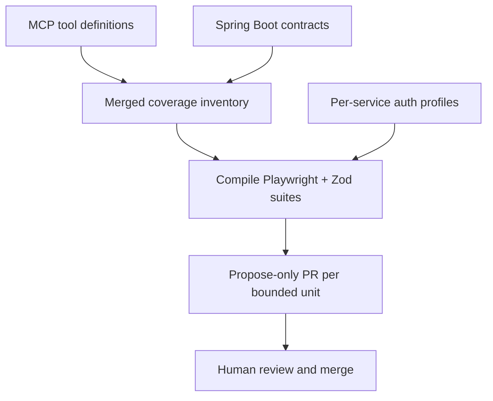
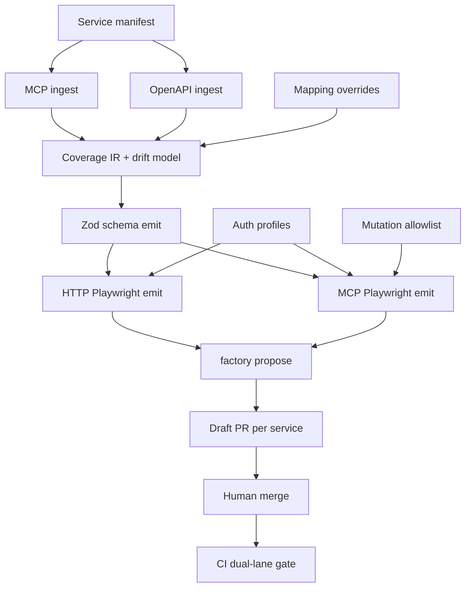
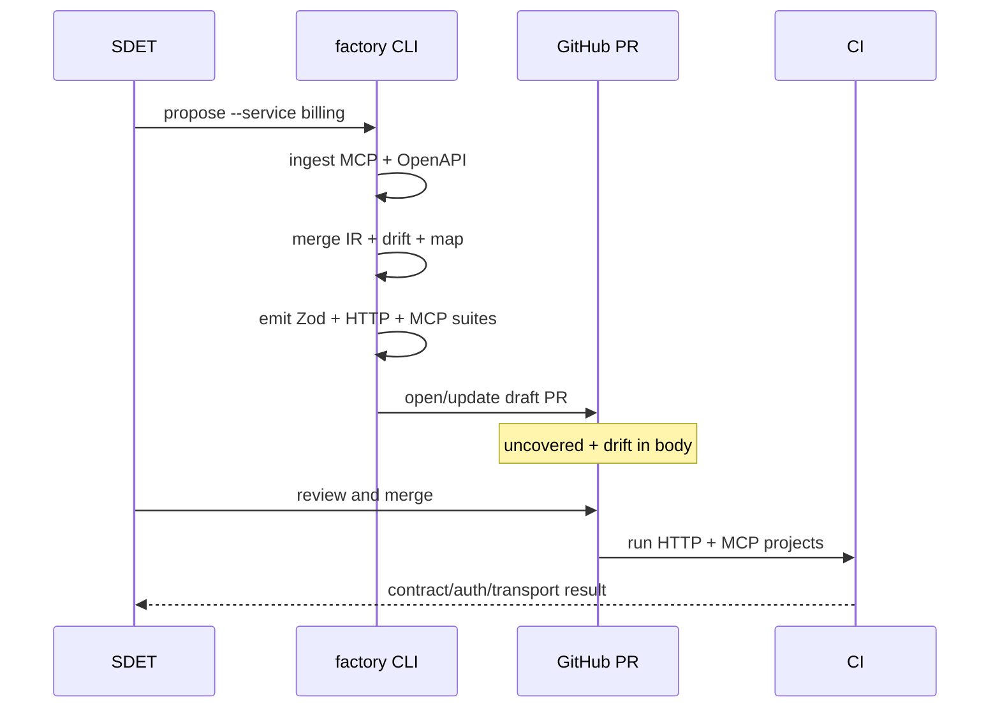

# API Automation Factory - Plan

## Goal Capsule

- **Objective:** Build a compile-first factory that turns MCP tool surfaces plus Spring Boot API contracts into deterministic Playwright suites (HTTP + live MCP calls) with Zod validation, proposed only via human-reviewed PRs, designed to scale across the API ecosystem.
- **Product authority:** This plan owns the automation factory product shape (inventory model, emit behavior, trust model, coverage definition). Target Spring Boot services and MCP server implementations are inputs, not this plan's build scope.
- **Authority hierarchy:** Product Contract (R/A/F/AE/KD) → Planning Contract (KTD) → Implementation Units → Verification Contract → Definition of Done.
- **Execution profile:** Greenfield TypeScript factory in this repository; CLI + CI operator surfaces; propose-only PR emission.
- **Stop conditions:** Dual-lane emit + propose-only PR path proven against a fixture service; factory goldens and CI gates green; no auto-merge; LLM remaining optional/marginal.
- **Open blockers:** None for planning. Load-bearing assumptions are recorded under Planning Contract Assumptions.
- **Product Contract preservation:** Product Contract meaning and R1–R11 / KD1–KD7 IDs unchanged. Clarified Success Criteria (propose vs rollout completeness), added AE5–AE12 and F4–F7 for confirmed edge journeys and security gates, and recorded plan-time HOW under Planning Contract KTDs (including deepened security/IR boundaries).

---

## Product Contract

### Summary

An ecosystem-scale API automation factory compiles MCP definitions and Spring Boot contracts into deterministic Playwright tests with Zod checks for both HTTP endpoints and live MCP tool calls. It opens propose-only PRs for human review. OpenAI assists only at the margins (auth wiring, unmapped leftovers), not as free-form suite authorship.

### Problem Frame

Teams already invest in Playwright at the UI layer and only touch APIs through integration paths. Those APIs are now exposed as MCP servers consumed by agentic apps, so silent contract breaks hit agents rather than a human clicking through a UI. Manual or UI-driven coverage cannot keep pace with the full MCP surface across the ecosystem.

### Key Decisions

- KD1. Schema-compiler factory — Prefer compile-from-contracts emit over LLM-walks-repos or inventory-as-primary product. `(session-settled: user-directed — chosen over inventory-first (A) and LLM-walks-repos (B): maximize deterministic emit at ecosystem scale)` Governs R1, R8.
- KD2. Dual inventory — MCP defines the coverage surface; Spring Boot supplies request/response contract detail. `(session-settled: user-directed — chosen over MCP-only or Spring-only: agents call MCP while HTTP contracts live in Spring)` Governs R2, R3.
- KD3. Propose-only trust model — Factory never auto-merges generated suites; humans review and merge. `(session-settled: user-directed — chosen over auto-land and hybrid: review quality owns generated HTTP + MCP tests)` Governs R7.
- KD4. Dual validation lanes — Every covered capability gets HTTP contract tests and live MCP tool-invocation tests, both Zod-validated. `(session-settled: user-directed — chosen over coverage-mapping-only or HTTP-only: success requires both lanes)` Governs R4, R5, R6.
- KD5. Per-service auth profiles — Auth is configured per MCP/API service (OAuth, API key, basic, etc.), not a single shared login fixture. `(session-settled: user-directed — chosen over shared-only or env-token-only: ecosystem services differ)` Governs R9.
- KD6. Deterministic identity — Product validates API/MCP contracts only; UI Playwright and agent/LLM evals stay outside. `(session-settled: user-directed — chosen over including UI or agent evals: UI remains a separate practice; agent evals are non-deterministic)` Governs Scope Boundaries.
- KD7. MCP coverage floor on drift — When Spring enrichment is missing or conflicts, MCP-defined tools and mapped endpoints still get proposed tests; Spring Zod richness is best-effort; MCP↔Spring drift is reported in the propose PR. Governs R3, R11.



### Actors

- A1. SDET / QA automation owner — primary consumer; reviews propose PRs and maintains auth profiles / exclusions.
- A2. API / MCP service owner — supplies Spring Boot and MCP sources; responds to drift findings.
- A3. CI / quality gate — runs merged deterministic suites against target environments.
- A4. Automation factory — compiles inventory, emits suites, opens propose PRs.

### Requirements

**Inventory and coverage**

- R1. The factory compiles tests from structured MCP and Spring Boot contract inputs rather than authoring suites primarily via free-form LLM generation.
- R2. MCP tool/server definitions are the authoritative inventory of capabilities that must be covered.
- R3. Spring Boot sources enrich request/response contracts for Zod schemas; missing Spring detail must not drop an MCP capability from coverage proposals (per KD7).
- R4. For each in-scope MCP tool, the factory proposes a live MCP tool-invocation test with Zod validation of results.
- R5. For each HTTP endpoint mapped from the inventory, the factory proposes a Playwright API test with Zod validation of responses.
- R6. A rollout is successful only when every in-scope, non-excluded capability with an HTTP mapping has both HTTP and MCP validations in the merged suite; unmapped tools remain rollout blockers until mapped or excluded (see Success Criteria; KD7 still requires MCP-floor propose coverage).

**Trust, emit, and auth**

- R7. Generated or updated suites are delivered only as propose-only PRs or diffs; the factory does not auto-merge.
- R8. OpenAI (or equivalent LLM) use is limited to margin tasks such as auth-profile wiring hints and unmapped leftovers; compiled contracts remain the emit source of truth.
- R9. Authentication for generated tests uses per-service auth profiles.
- R10. Propose PRs are bounded (for example per service or equivalent reviewable unit) so ecosystem-scale emit stays reviewable under R7.
- R11. When contracts are incomplete for compile-first emit, the factory still proposes what it can and lists uncovered tools/endpoints and MCP↔Spring drift findings explicitly in the PR.

### Key Flows

- F1. Full-surface propose for a service
  - **Trigger:** Operator runs the factory against one or more MCP servers and their Spring Boot codebases.
  - **Actors:** A1, A2, A4
  - **Steps:** Ingest MCP defs and Spring contracts; merge inventory; compile HTTP + MCP Playwright/Zod suites; attach auth profiles; open bounded propose PR including uncovered list and drift findings.
  - **Outcome:** Reviewable PR covering the service's MCP surface and mapped endpoints without auto-merge.
  - **Covered by:** R1–R5, R7, R9–R11

- F2. Contract change regeneration
  - **Trigger:** MCP or Spring contracts change for an already-covered service.
  - **Actors:** A1, A4
  - **Steps:** Recompile affected suites; open propose PR with stable, reviewable diffs; report new drift or coverage gaps.
  - **Outcome:** Humans merge updates; merged suites remain the CI source of truth.
  - **Covered by:** R1, R7, R8, R10, R11

- F3. CI gate after merge
  - **Trigger:** Proposed suite is merged.
  - **Actors:** A1, A3
  - **Steps:** CI runs deterministic HTTP and MCP tests with configured auth profiles; failures block on contract breaks.
  - **Outcome:** Breaking API/MCP changes are caught before agentic consumers depend on them.
  - **Covered by:** R4, R5, R6, R9

- F4. Service onboarding
  - **Trigger:** A1 registers a new service for factory coverage.
  - **Actors:** A1, A4
  - **Steps:** Create service manifest (MCP source, OpenAPI/Spring source, auth profile id, optional mapping/exclusions); run F1 for that service id.
  - **Outcome:** First propose PR for the service without inventing ad-hoc CLI flags per run.
  - **Covered by:** R2, R9, R10

- F5. Auth profile create / rotate
  - **Trigger:** A1 adds or rotates credentials for a service.
  - **Actors:** A1, A3
  - **Steps:** Edit auth profile (env-var *names* only); provision secret values in CI; verify F3 auth-class failures are explicit when secrets are missing.
  - **Outcome:** Per-service auth works without embedding secrets in generated tests.
  - **Covered by:** R9

- F6. Exclusion and mutation allowlist maintenance
  - **Trigger:** A1 marks tools/endpoints out of live coverage or allows mutating MCP tools.
  - **Actors:** A1, A4
  - **Steps:** Update exclusion / mutation-allowlist entries with reasons; re-run F1/F2; PR lists intentionally uncovered items separately from gaps.
  - **Outcome:** Unsafe or out-of-scope tools are not silently invoked; R6 does not treat intentional exclusions as blockers.
  - **Covered by:** R4, R6, R11

- F7. Drift remediation handoff
  - **Trigger:** Propose PR reports MCP↔Spring drift or uncovered tools.
  - **Actors:** A1, A2, A4
  - **Steps:** A1 assigns/mentions A2 using PR Drift/Uncovered sections; A2 fixes contracts or mapping; A1 re-runs F1/F2.
  - **Outcome:** Drift is actionable without an automated ping loop in v1.
  - **Covered by:** R3, R11, KD7

### Acceptance Examples

- AE1. MCP tool with rich Spring DTO
  - **Covers:** R2, R3, R4, R5
  - **Given:** An MCP tool maps to a Spring endpoint with documented request/response types
  - **When:** The factory runs for that service
  - **Then:** The propose PR includes both a Zod-validated HTTP Playwright test and a live MCP tool-invocation test for that capability

- AE2. MCP tool without Spring enrichment
  - **Covers:** R3, R7, R11, KD7
  - **Given:** An MCP tool exists but Spring contract detail is missing or conflicting
  - **When:** The factory runs
  - **Then:** A coverage proposal for that MCP tool is still included; Spring Zod richness may be thinner; drift/gap is listed in the PR; nothing is auto-merged

- AE3. Human trust boundary
  - **Covers:** R7, R10
  - **Given:** The factory emits suites for multiple services
  - **When:** Emit completes
  - **Then:** Changes appear only as bounded propose PRs; no branch is force-merged by the factory

- AE4. Success bar for a targeted surface
  - **Covers:** R6
  - **Given:** A service's available endpoints and MCP tools are in scope
  - **When:** Rollout for that surface is considered complete
  - **Then:** Both endpoint validations and MCP tool-call validations exist in the merged suite for that surface

- AE5. Unmapped MCP tool
  - **Covers:** R2, R4, R11, KD7
  - **Given:** An MCP tool has no HTTP mapping after heuristics and override table
  - **When:** The factory runs
  - **Then:** An MCP-lane test is still proposed; no HTTP test for that tool; the tool appears in the PR uncovered list

- AE6. Missing CI secret
  - **Covers:** R9
  - **Given:** An auth profile references an unset required secret
  - **When:** CI runs merged suites
  - **Then:** Failure is classified as auth/setup, not as a Zod/contract mismatch

- AE7. Mutating MCP tool without allowlist
  - **Covers:** R4, R11
  - **Given:** An MCP tool is classified mutating and is not on the mutation allowlist
  - **When:** The factory emits
  - **Then:** The tool is not invoked live; it is listed intentionally uncovered with reason `mutation-not-allowlisted`

- AE8. No-delta regeneration
  - **Covers:** R7, R10, F2
  - **Given:** Contracts and inventory are unchanged since the last emit
  - **When:** F2 runs
  - **Then:** No new propose PR is opened (or empty-diff PR is skipped)

- AE9. Generated file ownership
  - **Covers:** R1, F2
  - **Given:** A generated suite file was hand-edited
  - **When:** The next regeneration runs
  - **Then:** Only generated paths are overwritten; hand-written support/fixtures are preserved

- AE10. Secret non-leak
  - **Covers:** R7, R9
  - **Given:** An auth profile contains value-like secret material instead of an env-var name, or emit would bake a bearer token into generated output
  - **When:** Profile load or emit runs
  - **Then:** Setup fails before propose; generated goldens contain no Authorization/bearer/token literals

- AE11. Propose least privilege
  - **Covers:** R7, R10
  - **Given:** The propose path runs against a mocked GitHub client / reviewed workflow
  - **When:** Emit completes
  - **Then:** Only draft PR create/update on `factory/<service-id>` occurs; no merge, approve, or default-branch push

- AE12. Egress allowlist
  - **Covers:** R9
  - **Given:** A service manifest declares a base URL / MCP endpoint outside the allowlisted non-prod/fixture hosts
  - **When:** Propose or suite setup runs
  - **Then:** Setup-class failure occurs before any HTTP or MCP network call

### Success Criteria

- **Propose completeness:** Targeted MCP surface is represented in a propose PR with dual-lane emit where mapping exists, MCP floor where it does not, plus explicit uncovered/drift lists (KD7, R11).
- **Rollout completeness (R6 / AE4):** For every in-scope, non-excluded capability with an HTTP mapping, both HTTP and MCP validations exist in the merged suite. Unmapped tools remain R6 blockers until mapped or excluded.
- Propose PRs remain human-reviewable (bounded units, explicit uncovered/drift lists).
- CI on merged suites fails on breaking contract changes without requiring UI journeys; auth/transport failures are labeled separately from contract failures.
- LLM involvement stays optional/marginal; compile path works when contracts are present.

### Scope Boundaries

**In scope**

- Compiling deterministic Playwright API and MCP tool tests with Zod validation
- Merging MCP + Spring inventories for coverage
- Per-service auth profiles
- Propose-only PR emission at ecosystem scale (phased rollout allowed)
- CLI operator surface and CI workflows that wrap the same CLI

**Deferred for later**

- Automatic regeneration on every upstream commit without an operator/CI trigger policy (v1 is operator/CI workflow only)
- Cross-service orchestration scenarios beyond per-capability HTTP/MCP contracts
- Exposing the factory itself as MCP tools / agent operator surface (CLI + CI first)
- Optional provider-side fuzz (e.g. Schemathesis) as a complementary gate

**Deferred to Follow-Up Work**

- Multi-role auth matrix beyond per-service profiles
- Pact / consumer-driven contract layers
- oasdiff-as-required merge gate (optional companion after propose path lands)

**Outside this product's identity**

- UI / browser Playwright generation or maintenance
- Agent-behavior evaluation or non-deterministic LLM evals
- Load/performance testing and security fuzzing as primary outputs
- Replacing existing UI Playwright practice
- Auto-merge of factory PRs; OAuth consent / secret minting by the factory
- Storing secret values in git or generated artifacts; invoking non-allowlisted mutating MCP tools; free-form LLM suite authorship

### Dependencies / Assumptions

- **Assumption:** Primary user is the SDET/QA automation owner (A1); correct if a different role owns propose-PR review.
- **Assumption:** Target APIs are reachable as both HTTP services and MCP servers in environments where tests run (default: non-prod staging URLs in profiles).
- **Assumption:** Spring Boot codebases expose extractable OpenAPI (preferred) or equivalent contracts, and MCP server definitions are available as factory inputs.
- **Assumption:** KD7 (MCP coverage floor) and R11 (partial propose + uncovered list) are accepted defaults from synthesis call-outs.
- **Dependency:** Per-service credentials/secrets exist for auth profiles used in CI after merge.
- **Dependency:** This repository is greenfield; factory implementation lands here, while Spring/MCP sources may live in external repos.

### Outstanding Questions

**Resolve Before Planning**

- None.

**Deferred to Implementation**

- Exact MCP JSON Schema subset supported in IR normalization (tune against fixture + first real service).
- Whether CI propose workflow regenerates then commits on `factory/<service>` vs relying solely on local CLI commits (default remains commit-on-propose to factory branch).
- Final verb-heuristic details for mutation classification beyond fail-closed unknown + metadata/annotation preference (KTD8).

---

## Planning Contract

### Assumptions

- Stack is Node 22 LTS + TypeScript ESM + Playwright + Zod 4 + Vitest for factory unit/golden tests.
- Spring contract primary input is exported OpenAPI 3.x (springdoc CI artifact); controller/DTO parsing is fallback only.
- Operator surface for v1 is CLI + wrapping GitHub Actions; factory-as-MCP-tools is deferred.
- Default PR bounding unit is one propose PR per service (batch CLI may open N PRs).
- MCP↔HTTP mapping uses heuristics (`operationId` / tool name / path) plus a per-service override table; unmapped tools stay on the MCP coverage floor.
- Generated suites are committed under dedicated generated paths; hand edits live only under support/fixtures.
- Live MCP invokes read/idempotent tools by default; mutating tools require an explicit allowlist or are intentionally uncovered.
- Emit/compile is offline from static defs + OpenAPI artifacts; live HTTP/MCP calls happen in CI (and optional local smoke).
- External research was load-bearing for OpenAPI→Zod spine, MCP TS SDK testing, springdoc export, and propose-only PR automation.
- Coverage IR is versioned (`coverage-ir/v1`); emit refuses unknown major versions.
- Propose no-delta compares IR content hash + generator package versions, not only empty git diffs.
- Default: commit generated output from propose CLI onto `factory/<service-id>` only (never main).

### Key Technical Decisions

- KTD1. TypeScript greenfield stack — Node 22 + Playwright APIRequestContext + Zod 4 + Vitest. Chosen over Python-centric generators so HTTP and MCP lanes share one runtime with the official MCP TypeScript client. Governs U1.
- KTD2. Exported OpenAPI as Spring input — Prefer springdoc `/v3/api-docs` (or build-time export) committed/fetched as `contracts/<service>/openapi.yaml`. Controller AST parsing is fallback only when export is unavailable and must record lower confidence in the PR. `(session-settled: user-approved — chosen over controller-parse-first: shared OAS artifact feeds Zod, drift, and MCP mapping)` Governs R3, U2.
- KTD3. Service manifest as onboarding unit — Each service has a manifest naming MCP source, OpenAPI source, auth profile id, mapping overrides, exclusions, and mutation allowlist. CLI `factory propose --service <id>` reads it. Governs R10, F4, U2.
- KTD4. Three-layer emit — Normalized coverage IR → Zod schemas → Playwright HTTP + MCP tests. Same IR feeds both lanes; deterministic sorted emit for stable diffs. Inventory is the sole IR writer; emit is a pure function of IR + support overlays. Governs R1, R4, R5, U3–U4.
- KTD5. Mapping strategy — Heuristic match plus `support/mappings/<service>.yaml` overrides; never infer solely from free-text descriptions. Unmapped → MCP floor + uncovered list (AE5). Override pairs should warn on method/schema incompatibility before emit. `(session-settled: user-approved — chosen over convention-only or manual-only)` Governs R2, R5, R11, U2–U3.
- KTD6. Generated vs support separation — Generated files under `generated/` carry ownership banners and are overwrite-safe; auth fixtures, matchers, and overrides live under `support/`. Generated specs may import only `support/fixtures/*` and `generated/<service>/schemas/*`. Governs AE9, U4.
- KTD7. Auth profiles as YAML with env refs — Profiles declare auth type and secret *names* only (`^[A-Z0-9_]+$`); CI injects values. Reject profiles containing value-like secret material. Never log resolved secrets; scrub auth headers from Playwright traces. Generated tests reference profile **id**; env names resolve only at runtime in support fixtures. Missing required secret → auth-class failure (AE6, AE10). Governs R9, U4–U5.
- KTD8. Mutation allowlist for live MCP — Non-allowlisted mutating tools are not invoked live (AE7). Unknown/ambiguous tools classify as mutating (fail closed). Classifier preference: explicit metadata > annotation > verb heuristic; output is an IR field. `(session-settled: user-approved — chosen over invoke-all-tools: CI safety)` Governs R4, F6, U4.
- KTD9. Propose-only via CLI + create-pull-request — `factory propose` compiles, writes suites, and opens/updates a draft PR on `factory/<service-id>` using a dedicated GitHub App or fine-scoped PAT with peter-evans/create-pull-request (or equivalent); never auto-merge; never push default branch; path-restricted to `generated/<service>/**` plus report metadata. Concurrent proposes: last-write-wins with force-with-lease on that factory branch only. One branch/PR per service; no-delta skips PR (AE8, AE11). Governs R7, R10, U5.
- KTD10. CLI-first operator surface — Machine-readable reports and exit codes so CI wraps the same path; factory MCP operator tools deferred. `(session-settled: user-approved — chosen over factory-MCP-now)` Governs F1, U1, U5.
- KTD11. Zod generation spine — Prefer `@hey-api/openapi-ts` Zod plugin (or equivalent OAS→Zod) for rich HTTP schemas. For mapped capabilities, HTTP and MCP lanes import the **same** generated schema module; MCP-only tools use thin/best-effort schemas under KD7. Governs R3, R5, U3.
- KTD12. Failure taxonomy — Classify `contract` | `auth` | `transport` | `setup` in suite assertions (support helpers) and CI annotations. Propose/operator failures use `setup` (manifest/git/gh). Only contract mismatches are the product quality signal. Governs F3, AE6, U5–U6.
- KTD13. Egress allowlist — Manifest `baseUrl` / MCP endpoint must match allowlisted non-prod/fixture host patterns; disallowed hosts fail setup before network (AE12). Prod URLs require an explicit separate profile + human flag (default deny). Governs R9, U2, U4, U6.
- KTD14. LLM margin boundary — Allowed: auth wiring *hints* and unmapped leftover *suggestions* in PR body only, with redacted inputs (no env values). Forbidden: writing IR, Zod, Playwright sources, allowlists, profiles, or merges. Default off. Governs R8, U5.
- KTD15. Contracts lock policy — Manifest declares OpenAPI mode `lockfile` or `fetch` plus ref; PR body always records digest/URI used so F2 diffs stay attributable. Governs R3, F2, U2.

### High-Level Technical Design





Artifact lifecycle: contracts lock → IR (`coverage-ir/v1`) → generated → draft PR → human merge to main → CI dual-lane gate. Human-only gates: merge, secret minting, mutation allowlist, exclusions, mapping overrides, prod host allowlist.

### System-Wide Impact

- **Package interfaces:** Versioned Coverage IR is the only inventory→emit boundary; machine-readable report schema is shared by CLI stdout, PR body, and CI annotations; service id joins manifest, auth profile, Playwright projects, and branch names.
- **Failure propagation:** Corrupt MCP defs fail setup before git write; missing OpenAPI continues with KD7 drift; auth/transport must be labeled in `support/` assertion helpers, not only after-the-fact reports; pin generator versions to avoid propose/CI skew.
- **Generated artifact lifecycle:** States are emitted → proposed → merged → CI-validated → stale on upstream contract change. No-delta uses IR hash + generator versions. Dirty hand-edits under `generated/` are clobbered and called out in the PR.
- **Human-only:** Merge, secret provisioning, allowlist/exclusion/override edits, first staging onboarding, workflow/bot permission changes.
- **Agent-native Later:** Factory MCP operator tools; auto-regen-on-commit; multi-role auth; Pact/oasdiff required gates.
- **Agent-native Never:** Auto-merge; UI Playwright product; agent/LLM evals; LLM suite authorship; prose-invented mappings; secrets in generated output.

### Output Structure

```text
api-automation-factory/
├── package.json
├── tsconfig.json
├── playwright.config.ts
├── vitest.config.ts
├── src/
│   ├── cli/                    # factory CLI entrypoints
│   ├── ingest/                 # MCP + OpenAPI adapters
│   ├── inventory/              # IR, merge, drift, mapping
│   ├── emit/                   # Zod + Playwright emitters
│   ├── auth/                   # profile loader
│   ├── propose/                # PR body + git/gh integration
│   └── report/                 # machine-readable reports + failure classes
├── contracts/                  # per-service OpenAPI + MCP lock/defs
│   └── <service>/
├── support/
│   ├── profiles/               # auth YAML (env refs only)
│   ├── mappings/
│   ├── exclusions/
│   └── fixtures/               # Playwright fixtures / matchers
├── generated/                  # overwrite-owned emitted suites + schemas
│   └── <service>/{http,mcp,schemas}/
├── fixtures/demo-service/      # local fixture for goldens + dual-lane proof
├── tests/
│   ├── unit/                   # factory unit tests
│   └── golden/                 # emit golden trees
└── .github/workflows/
    ├── factory-propose.yml
    ├── factory-ci.yml
    └── suites.yml
```

### Alternative Approaches Considered

- **LLM-first suite authorship** — Rejected per KD1/R8; non-deterministic coverage and weak review diffs.
- **Inventory-first product without emit** — Rejected per KD1; coverage maps alone do not catch contract breaks in CI.
- **Pact/BDCT as primary** — Deferred; valuable later but heavier than schema-compiled Playwright+Zod for v1 dual lanes.
- **Factory MCP operator tools in v1** — Deferred (KTD10); would add a second control plane before CLI/CI trust is proven.

### Risks & Dependencies

| Risk | Mitigation |
|------|------------|
| Greenfield — no local patterns | Lock stack in U1; fixture service + goldens before multi-service rollout |
| hey-api / Zod 4 / MCP SDK churn | Pin generator versions; isolate generated imports; record versions in PR body |
| Live MCP mutates shared staging data | Fail-closed mutation class + human allowlist (KTD8); staging-only bases (KTD13) |
| Secret leakage via emit/PR/LLM | Names-only profiles; secret-pattern gate on `generated/`; LLM redaction (KTD7, KTD14, AE10) |
| Over-privileged propose bot | Dedicated App/PAT; draft-only; path filters; AE11 gate (KTD9) |
| Malicious/untrusted OAS/MCP inputs | Treat as data not code; no eval of examples; egress allowlist (KTD13) |
| Dual Zod spine divergence | Shared schema module per mapped IR id (KTD11) |
| Stale locked OpenAPI false greens | Record digest/URI (KTD15); refresh policy per service |
| Spring export ≠ runtime prod | Document openapi profile; record source used in PR |
| GITHUB_TOKEN may not trigger downstream PR CI | Document App/PAT when needed; never auto-merge |
| MCP↔HTTP name divergence | Override table + uncovered list; do not invent mappings from prose |

### Sources & Research

- Product contract: this file (ce-brainstorm requirements-only origin).
- Prior art: `@hey-api/openapi-ts` Zod plugin; `@modelcontextprotocol` TypeScript client testing guide; springdoc-openapi export; peter-evans/create-pull-request propose-only pattern; oasdiff / MCP manifest diff tools as optional companions.
- Repo research: greenfield (README + this plan only); no `docs/solutions/` learnings; no institutional conventions beyond plan PR history.

---

## Implementation Units

### U1. Greenfield scaffold and CLI skeleton

- **Goal:** Establish the TypeScript workspace, package scripts, Playwright/Vitest tooling, and a non-interactive `factory` CLI stub that can later host propose.
- **Requirements:** R1, R8, R10; KTD1, KTD10
- **Dependencies:** None
- **Files:**
  - create: `package.json`, `tsconfig.json`, `vitest.config.ts`, `playwright.config.ts`, `.gitignore`
  - create: `src/cli/index.ts`, `src/cli/commands/propose.ts` (stub)
  - create: `tests/unit/cli/help.test.ts`
  - modify: `README.md` (dev setup + CLI overview only)
- **Approach:**
  1. Pin Node 22, Zod 4, Playwright, Vitest, TypeScript ESM.
  2. Expose `factory --help` and `factory propose --help` with machine-readable exit codes.
  3. Keep LLM optional and off by default (R8).
- **Execution note:** Prefer install/runtime smoke for toolchain; unit-test CLI help/exit codes.
- **Test scenarios:**
  - Happy path: `factory --help` exits 0 and lists `propose`.
  - Happy path: package scripts `test:unit` and `test:e2e` are defined (e2e may skip until U5).
  - Error path: unknown command exits non-zero with stable error code.
- **Verification:** Fresh clone install succeeds; CLI help works without network to target services.

### U2. Service manifest, dual ingest, inventory IR, mapping, and drift

- **Goal:** Ingest MCP defs + OpenAPI, merge into coverage IR with mapping overrides, exclusions, and drift/uncovered reports.
- **Requirements:** R1–R3, R11; KD2, KD7; KTD2–KTD5; F4, F7; AE2, AE5
- **Dependencies:** U1
- **Files:**
  - create: `src/ingest/mcp.ts`, `src/ingest/openapi.ts`
  - create: `src/inventory/ir.ts`, `src/inventory/merge.ts`, `src/inventory/map.ts`, `src/inventory/drift.ts`
  - create: `contracts/demo/` sample MCP + OpenAPI fixtures
  - create: `support/mappings/demo.yaml`, `support/exclusions/demo.yaml`
  - create: `tests/unit/inventory/merge.test.ts`, `tests/unit/inventory/map.test.ts`, `tests/unit/inventory/drift.test.ts`
  - create: service manifest schema under `src/inventory/manifest.ts` + `contracts/demo/service.manifest.yaml`
- **Approach:**
  1. Manifest names MCP source, OpenAPI source, auth profile id, mapping/exclusion/allowlist paths.
  2. MCP tools are coverage authority; OpenAPI enriches schemas.
  3. Heuristic map + overrides; unmapped tools remain in IR with `httpMapped: false`.
  4. Drift model records missing Spring, param mismatches, and description-level warnings.
  5. Emit path must not drop MCP tools when OpenAPI enrichment fails (KD7).
  6. IR carries `coverage-ir/v1` version, mutation class field, and OpenAPI digest/URI (KTD15).
  7. Manifest host/baseUrl validated against egress allowlist before any later network use (KTD13).
- **Execution note:** Implement IR merge and mapping test-first with fixture contracts.
- **Test scenarios:**
  - Covers AE1 inputs: tool with matching OpenAPI operation lands mapped in IR.
  - Covers AE2 / AE5: tool without OpenAPI enrichment or mapping remains in IR; drift/uncovered entries present.
  - Covers AE12: disallowed baseUrl fails setup before ingest network fetch when mode is `fetch`.
  - Edge: empty MCP tool list yields empty coverage with explicit report.
  - Error: missing OpenAPI file records Spring-missing drift without throwing away MCP tools.
  - Error: unknown IR major version is refused by emit consumers (covered in U3; schema field set here).
  - Happy path: override table forces a divergent name pair to map.
- **Verification:** Unit tests prove merge/map/drift against `contracts/demo` without live network.

### U3. Zod schema emit from inventory

- **Goal:** Generate Zod schemas (rich from OpenAPI; thin/best-effort from MCP-only tools) consumed by both lanes.
- **Requirements:** R1, R3, R5; KTD4, KTD11; KD7
- **Dependencies:** U2
- **Files:**
  - create: `src/emit/zod.ts`
  - create: `generated/demo/schemas/` (emitted)
  - create: `tests/unit/emit/zod.test.ts`
  - create: `tests/golden/demo-schemas.golden/` (or equivalent snapshot tree)
- **Approach:**
  1. Prefer `@hey-api/openapi-ts` Zod plugin for OpenAPI-backed operations.
  2. Mapped capabilities emit one shared schema module imported by both lanes (KTD11).
  3. MCP-only tools get JSON Schema → Zod best-effort or thin schemas with drift annotation.
  4. Deterministic file names and export order from stable IR ids; refuse unknown IR major versions.
  5. Never hand-edit generated schema files.
- **Test scenarios:**
  - Happy path: OpenAPI response object yields Zod object schema file shared by HTTP and MCP imports.
  - Covers KD7: MCP-only tool still emits a usable validator artifact.
  - Edge: `oneOf`/`anyOf` produce a defined fallback without crashing emit.
  - Golden: same inputs twice produce byte-identical schema tree.
  - Error: IR with unsupported major version fails emit with setup-class error.
- **Verification:** Goldens pass; generated schemas import cleanly from TypeScript.

### U4. Dual-lane Playwright emit, auth fixtures, and mutation allowlist

- **Goal:** Emit HTTP Playwright API tests and live MCP tool tests with shared Zod validation, auth profile fixtures, and safe mutation policy.
- **Requirements:** R4–R6, R9; KD4, KD5; KTD6–KTD8; F3, F5, F6; AE1, AE4, AE6, AE7, AE9
- **Dependencies:** U3
- **Files:**
  - create: `src/emit/http.ts`, `src/emit/mcp.ts`, `src/emit/templates/`
  - create: `src/auth/loadProfile.ts`
  - create: `support/profiles/demo.yaml`, `support/fixtures/auth.ts`, `support/fixtures/expectZod.ts`
  - create: `support/exclusions/` mutation allowlist path referenced by manifest
  - create: `generated/demo/http/`, `generated/demo/mcp/`
  - create: `tests/unit/emit/http.test.ts`, `tests/unit/emit/mcp.test.ts`, `tests/unit/auth/loadProfile.test.ts`
  - create: `tests/golden/demo-suites.golden/`
  - modify: `playwright.config.ts` (per-service projects for http/mcp)
- **Approach:**
  1. HTTP lane: Playwright `APIRequestContext` + status assert + Zod `safeParse`.
  2. MCP lane: official TS client transport appropriate for fixture (in-memory or HTTP); check `isError` before parsing `structuredContent`.
  3. Auth profiles supply headers/tokens via fixtures; secrets never written into generated tests; reject value-like profile material (AE10).
  4. Mutating/unknown tools without allowlist → intentionally uncovered, not invoked (fail closed).
  5. Ownership banners on generated specs; overwrite only generated paths.
  6. Assertion helpers attach failure class (`contract`/`auth`/`transport`/`setup`); scrub auth headers from traces.
  7. Secret-pattern gate fails emit if generated tree would contain bearer/token literals.
- **Execution note:** Emitter goldens first; live dual-lane smoke against fixture service in U5/U6. Land mutation fail-closed + secret gate before external staging.
- **Test scenarios:**
  - Covers AE1: mapped capability emits both HTTP and MCP specs importing shared schema.
  - Covers AE7: mutating or unknown tool absent from allowlist produces uncovered entry and no live call in emitted MCP suite.
  - Covers AE9: regen overwrites generated path; `support/fixtures` unchanged.
  - Covers AE10: profile with embedded secret value fails load; golden generated tree has no bearer/token literals.
  - Error: missing required secret name in profile fails auth loader with auth-class error code.
  - Edge: excluded tool appears as intentionally uncovered, not as a gap.
  - Happy path: Playwright projects `demo-http` and `demo-mcp` are configured.
- **Verification:** Emitter unit + golden tests green; sample generated specs typecheck.

### U5. Propose-only CLI/CI path and PR reporting

- **Goal:** Wire `factory propose` to write suites and open/update a draft per-service PR with coverage, drift, and uncovered sections — never merge.
- **Requirements:** R7, R10, R11; KD3; KTD9, KTD10, KTD12; F1, F2, AE3, AE8
- **Dependencies:** U4
- **Files:**
  - modify: `src/cli/commands/propose.ts`
  - create: `src/propose/prBody.ts`, `src/propose/gitBranch.ts`, `src/report/failureClass.ts`
  - create: `.github/workflows/factory-propose.yml`
  - create: `tests/unit/propose/prBody.test.ts`, `tests/unit/propose/noDelta.test.ts`
- **Approach:**
  1. `factory propose --service <id>` runs ingest→emit, then opens/updates `factory/<service-id>` draft PR.
  2. PR body includes coverage delta, drift, uncovered, intentionally uncovered, generator version, OpenAPI/MCP source refs/digests.
  3. No-delta → skip PR when IR hash + generator versions unchanged.
  4. Workflow wraps the same CLI; `draft: true`; dedicated App/PAT; path filters to `generated/<service>/**`; no auto-merge; bot must not modify `.github/workflows` or profile values.
  5. Concurrent runs reuse the same branch/PR per service (force-with-lease on factory branch only).
  6. Optional LLM hints section is off by default and cannot write IR/tests (KTD14).
- **Test scenarios:**
  - Covers AE3 / AE11: propose path never calls merge/approve APIs; workflow is draft-only.
  - Covers AE8: identical IR hash + generator versions → operation `none` / skip.
  - Happy path: PR body markdown contains Drift and Uncovered sections with tool ids.
  - Edge: batch `--service a --service b` yields two bounded PRs.
  - Error: propose without manifest fails with setup-class error before git writes.
  - Happy path: LLM disabled (`OPENAI_API_KEY` unset) still completes propose.
- **Verification:** Unit tests for PR body and no-delta; workflow file present and draft-only.

### U6. Fixture service, end-to-end proof, and post-merge CI gate

- **Goal:** Prove dual-lane coverage against a local fixture and add CI that runs factory tests plus merged suite projects with failure taxonomy.
- **Requirements:** R4–R6, R9; F3; AE1, AE4, AE6; KTD12
- **Dependencies:** U5
- **Files:**
  - create: `fixtures/demo-service/` (minimal HTTP API + MCP surface sharing one capability)
  - create: `.github/workflows/suites.yml`, `.github/workflows/factory-ci.yml`
  - create: `tests/e2e/demo-dual-lane.spec.ts` (or scripted propose→playwright against fixture)
  - modify: `README.md` (how to run fixture + CI expectations)
  - create: `tests/unit/report/failureClass.test.ts`
- **Approach:**
  1. Fixture exposes at least one mapped tool/endpoint pair and one MCP-only tool for KD7 proof.
  2. CI job A: factory unit + golden tests.
  3. CI job B: Playwright `demo-http` / `demo-mcp` against fixture with demo auth profile.
  4. Annotate failures with contract/auth/transport/setup classes.
- **Execution note:** Smoke-first for fixture bring-up; then assert AE1/AE4 on the fixture surface.
- **Test scenarios:**
  - Covers AE1 / AE4: fixture mapped capability passes both lanes after propose emit.
  - Covers AE2 path: MCP-only fixture tool emits MCP test and uncovered HTTP mapping note.
  - Covers AE6: unsetting demo secret yields auth-class failure annotation.
  - Integration: `factory propose --service demo` against fixture contracts produces reviewable diff without merge.
  - Error: stopping fixture mid-suite yields transport-class failure, not contract.
- **Verification:** Local and CI paths run factory tests and dual-lane fixture suites green with secrets provided.

---

## Verification Contract

| Gate | Command / check | Applies when | Pass signal |
|------|-----------------|--------------|-------------|
| Unit + golden | `npm test` (or `pnpm test`) running Vitest unit + golden suites | Every PR touching factory code | All unit/golden tests pass |
| Typecheck | `npm run typecheck` | Every PR | `tsc --noEmit` clean |
| Fixture dual-lane | Playwright projects `demo-http` and `demo-mcp` against `fixtures/demo-service` | After U4–U6; required for DoD | AE1/AE4 scenarios green |
| Propose dry path | `factory propose --service demo` in CI or local with draft PR disabled / mocked git | U5+ | Emits suites; PR body unit-covered; no merge |
| Auth failure class | Unset required demo secret and run suite job | U6 | Exit/annotation is `auth`, not `contract` |
| Secret non-leak | Golden/scan on `generated/` for token/bearer patterns | U4+ | Clean (AE10) |
| Propose permissions | Workflow review + unit mocks of GH client | U5+ | Draft-only; no merge (AE11) |
| Egress allowlist | Unit: bad baseUrl → setup failure | U2–U6 | Fail before network (AE12) |
| Trust boundary | Workflow/code review: no auto-merge; draft PR only | U5+ | No enable-automerge; propose-only permissions |

Greenfield note: exact package manager lockfile is chosen in U1; commands above use npm as placeholder and must match the lockfile committed in U1.

---

## Definition of Done

**Global**

- Global: Product Contract R1–R11 satisfied for the demo/fixture surface with propose-only delivery.
  - Demo DoD interprets R6 as: mapped demo capability has dual-lane merged coverage; the MCP-only KD7 proof tool is propose-complete (MCP lane + uncovered list) and is either excluded from rollout completeness or mapped before claiming full R6 on demo.
- Dual-lane emit works offline from contracts; live lanes pass against the fixture in CI.
- Drift/uncovered/intentional-uncovered reporting appears on propose PRs.
- No auto-merge; LLM remains optional/off by default.
- Abandoned spike code from implementation attempts is removed from the final diff.
- README documents CLI, manifests, auth profiles, and CI expectations.

**Per unit**

- U1: CLI skeleton and toolchain installable by a new contributor.
- U2: IR merge/map/drift unit-proven on demo contracts.
- U3: Zod emit goldens stable and importable.
- U4: Dual-lane generated suites + auth/mutation policy unit/golden proven.
- U5: Propose path opens/updates draft PR metadata without merge; no-delta skip works.
- U6: Fixture + CI gates green with failure taxonomy.

---

## Appendix

### Phased delivery

1. **Foundation** — U1–U2 (scaffold + inventory)
2. **Emit** — U3–U4 (Zod + dual-lane suites), including mutation fail-closed + secret non-leak gates before external staging
3. **Trust + prove** — U5–U6 (propose PR bot locks + fixture CI); onboard external staging only after AE10–AE12 green

### Operational notes

- Default target env for live suites is non-prod staging (or local fixture in this repo).
- Secrets stay in CI/secret store; profiles commit env-var names only.
- First external service onboarding uses the same manifest shape as `demo`.
- Human review checklist for factory PRs: drift classifications, allowlist/exclusion deltas, host/env changes, generated-path clobber notes.
