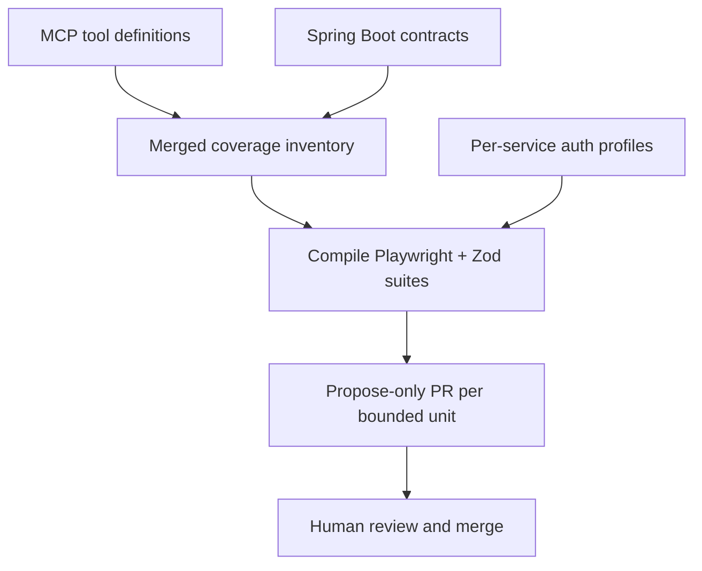

# API Automation Factory - Plan

## Goal Capsule

- **Objective:** Build a compile-first factory that turns MCP tool surfaces plus Spring Boot API contracts into deterministic Playwright suites (HTTP + live MCP calls) with Zod validation, proposed only via human-reviewed PRs, designed to scale across the API ecosystem.
- **Product authority:** This plan owns the automation factory product shape (inventory model, emit behavior, trust model, coverage definition). Target Spring Boot services and MCP server implementations are inputs, not this plan's build scope.
- **Open blockers:** None for planning. Load-bearing assumptions are recorded under Dependencies / Assumptions.

---

## Product Contract

### Summary

An ecosystem-scale API automation factory compiles MCP definitions and Spring Boot contracts into deterministic Playwright tests with Zod checks for both HTTP endpoints and live MCP tool calls. It opens propose-only PRs for human review. OpenAI assists only at the margins (auth wiring, unmapped leftovers), not as free-form suite authorship.

### Problem Frame

Teams already invest in Playwright at the UI layer and only touch APIs through integration paths. Those APIs are now exposed as MCP servers consumed by agentic apps, so silent contract breaks hit agents rather than a human clicking through a UI. Manual or UI-driven coverage cannot keep pace with the full MCP surface across the ecosystem.

### Key Decisions

- **KD1. Schema-compiler factory** — Prefer compile-from-contracts emit over LLM-walks-repos or inventory-as-primary product. `(session-settled: user-directed — chosen over inventory-first (A) and LLM-walks-repos (B): maximize deterministic emit at ecosystem scale)` Governs R1, R8.
- **KD2. Dual inventory** — MCP defines the coverage surface; Spring Boot supplies request/response contract detail. `(session-settled: user-directed — chosen over MCP-only or Spring-only: agents call MCP while HTTP contracts live in Spring)` Governs R2, R3.
- **KD3. Propose-only trust model** — Factory never auto-merges generated suites; humans review and merge. `(session-settled: user-directed — chosen over auto-land and hybrid: review quality owns generated HTTP + MCP tests)` Governs R7.
- **KD4. Dual validation lanes** — Every covered capability gets HTTP contract tests and live MCP tool-invocation tests, both Zod-validated. `(session-settled: user-directed — chosen over coverage-mapping-only or HTTP-only: success requires both lanes)` Governs R4, R5, R6.
- **KD5. Per-service auth profiles** — Auth is configured per MCP/API service (OAuth, API key, basic, etc.), not a single shared login fixture. `(session-settled: user-directed — chosen over shared-only or env-token-only: ecosystem services differ)` Governs R9.
- **KD6. Deterministic identity** — Product validates API/MCP contracts only; UI Playwright and agent/LLM evals stay outside. `(session-settled: user-directed — chosen over including UI or agent evals: UI remains a separate practice; agent evals are non-deterministic)` Governs Scope Boundaries.
- **KD7. MCP coverage floor on drift** — When Spring enrichment is missing or conflicts, MCP-defined tools and mapped endpoints still get proposed tests; Spring Zod richness is best-effort; MCP↔Spring drift is reported in the propose PR. Governs R3, R11.

### Actors

- A1. SDET / QA automation owner — primary consumer; reviews propose PRs and maintains auth profiles / exclusions.
- A2. API / MCP service owner — supplies Spring Boot and MCP sources; responds to drift findings.
- A3. CI / quality gate — runs merged deterministic suites against target environments.
- A4. Automation factory — compiles inventory, emits suites, opens propose PRs.

### Requirements

**Inventory and coverage**

- R1. The factory compiles tests from structured MCP and Spring Boot contract inputs rather than authoring suites primarily via free-form LLM generation.
- R2. MCP tool/server definitions are the authoritative inventory of capabilities that must be covered.
- R3. Spring Boot sources enrich request/response contracts for Zod schemas; missing Spring detail must not drop an MCP capability from coverage proposals (per KD7).
- R4. For each in-scope MCP tool, the factory proposes a live MCP tool-invocation test with Zod validation of results.
- R5. For each HTTP endpoint mapped from the inventory, the factory proposes a Playwright API test with Zod validation of responses.
- R6. A rollout is successful only when available endpoints and MCP tool calls for the targeted surface are both represented by proposed (and ultimately merged) validations.

**Trust, emit, and auth**

- R7. Generated or updated suites are delivered only as propose-only PRs or diffs; the factory does not auto-merge.
- R8. OpenAI (or equivalent LLM) use is limited to margin tasks such as auth-profile wiring hints and unmapped leftovers; compiled contracts remain the emit source of truth.
- R9. Authentication for generated tests uses per-service auth profiles.
- R10. Propose PRs are bounded (for example per service or equivalent reviewable unit) so ecosystem-scale emit stays reviewable under R7.
- R11. When contracts are incomplete for compile-first emit, the factory still proposes what it can and lists uncovered tools/endpoints and MCP↔Spring drift findings explicitly in the PR.

### Key Flows

- F1. Full-surface propose for a service
  - **Trigger:** Operator runs the factory against one or more MCP servers and their Spring Boot codebases.
  - **Actors:** A1, A2, A4
  - **Steps:** Ingest MCP defs and Spring contracts; merge inventory; compile HTTP + MCP Playwright/Zod suites; attach auth profiles; open bounded propose PR including uncovered list and drift findings.
  - **Outcome:** Reviewable PR covering the service's MCP surface and mapped endpoints without auto-merge.
  - **Covered by:** R1–R5, R7, R9–R11

- F2. Contract change regeneration
  - **Trigger:** MCP or Spring contracts change for an already-covered service.
  - **Actors:** A1, A4
  - **Steps:** Recompile affected suites; open propose PR with stable, reviewable diffs; report new drift or coverage gaps.
  - **Outcome:** Humans merge updates; merged suites remain the CI source of truth.
  - **Covered by:** R1, R7, R8, R10, R11

- F3. CI gate after merge
  - **Trigger:** Proposed suite is merged.
  - **Actors:** A1, A3
  - **Steps:** CI runs deterministic HTTP and MCP tests with configured auth profiles; failures block on contract breaks.
  - **Outcome:** Breaking API/MCP changes are caught before agentic consumers depend on them.
  - **Covered by:** R4, R5, R6, R9

### Acceptance Examples

- AE1. MCP tool with rich Spring DTO
  - **Covers:** R2, R3, R4, R5
  - **Given:** An MCP tool maps to a Spring endpoint with documented request/response types
  - **When:** The factory runs for that service
  - **Then:** The propose PR includes both a Zod-validated HTTP Playwright test and a live MCP tool-invocation test for that capability

- AE2. MCP tool without Spring enrichment
  - **Covers:** R3, R7, R11, KD7
  - **Given:** An MCP tool exists but Spring contract detail is missing or conflicting
  - **When:** The factory runs
  - **Then:** A coverage proposal for that MCP tool is still included; Spring Zod richness may be thinner; drift/gap is listed in the PR; nothing is auto-merged

- AE3. Human trust boundary
  - **Covers:** R7, R10
  - **Given:** The factory emits suites for multiple services
  - **When:** Emit completes
  - **Then:** Changes appear only as bounded propose PRs; no branch is force-merged by the factory

- AE4. Success bar for a targeted surface
  - **Covers:** R6
  - **Given:** A service's available endpoints and MCP tools are in scope
  - **When:** Rollout for that surface is considered complete
  - **Then:** Both endpoint validations and MCP tool-call validations exist in the merged suite for that surface

### Success Criteria

- Targeted MCP surface achieves dual-lane coverage (HTTP + MCP tool calls) via merged tests.
- Propose PRs remain human-reviewable (bounded units, explicit uncovered/drift lists).
- CI on merged suites fails on breaking contract changes without requiring UI journeys.
- LLM involvement stays optional/marginal; compile path works when contracts are present.

### Scope Boundaries

**In scope**

- Compiling deterministic Playwright API and MCP tool tests with Zod validation
- Merging MCP + Spring inventories for coverage
- Per-service auth profiles
- Propose-only PR emission at ecosystem scale (phased rollout allowed)

**Deferred for later**

- Automatic regeneration on every upstream commit without an operator/CI trigger policy (policy details left to planning)
- Cross-service orchestration scenarios beyond per-capability HTTP/MCP contracts

**Outside this product's identity**

- UI / browser Playwright generation or maintenance
- Agent-behavior evaluation or non-deterministic LLM evals
- Load/performance testing and security fuzzing as primary outputs
- Replacing existing UI Playwright practice

### Dependencies / Assumptions

- **Assumption:** Primary user is the SDET/QA automation owner (A1); correct if a different role owns propose-PR review.
- **Assumption:** Target APIs are reachable as both HTTP services and MCP servers in environments where tests run.
- **Assumption:** Spring Boot codebases (or extractable contracts from them) and MCP server definitions are available as factory inputs.
- **Assumption:** KD7 (MCP coverage floor) and R11 (partial propose + uncovered list) are accepted defaults from synthesis call-outs.
- **Dependency:** Per-service credentials/secrets exist for auth profiles used in CI after merge.
- **Dependency:** This repository is greenfield; factory implementation lands here, while Spring/MCP sources may live in external repos.

### Outstanding Questions

**Resolve Before Planning**

- None.

**Deferred to Planning**

- Q1. How MCP tools are mapped to HTTP endpoints when names/paths diverge (conventions, annotations, manual mapping table).
- Q2. Exact shape of per-service auth profile configuration and secret injection in CI.
- Q3. Playwright project layout and how generated HTTP tests vs MCP invocation tests are packaged.
- Q4. Which Spring artifacts are preferred for compile input when multiple exist (OpenAPI annotations, controllers+DTOs, exported specs).
- Q5. Operator interface for first rollout (CLI, CI workflow, or both) and default PR bounding unit.
