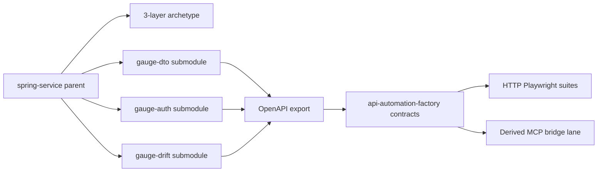

# Spring Submodule Workspace Factory Targets - Plan

## Goal Capsule

- **Objective:** Own a git-submodule Spring workspace under `asub927/spring-service` with a classic 3-layer archetype and three factory-stress gauge services, and hand off digested OpenAPI (+ derived MCP) contracts into `api-automation-factory` so factory-emitted suites execute and a fourth API can onboard without bespoke factory code.
- **Product authority:** This plan owns the Spring workspace shape, gauge-service product intent, and factory contract handoff for those targets. It does not own in-process Spring MCP servers or the factory's core compiler product (see parent factory plan).
- **Authority hierarchy:** Product Contract (R/A/F/AE/KD) → Planning Contract (KTD) → Implementation Units → Verification Contract → Definition of Done.
- **Open blockers:** Cloud agent cannot push to `asub927/spring-service` (403) and cannot create sibling remotes (403). Implementation of U1–U3 requires write access to `spring-service` plus three writable gauge remotes (pre-created empty repos are fine). Factory-side U4–U6 can proceed in `api-automation-factory` once OpenAPI lockfiles exist.
- **Surrounding work:** Dual-lane Spring `/mcp` truth source and intentional drift-sibling CI teaching are deferred follow-ons, not active scope.
- **Product Contract preservation:** Product Contract meaning and R1–R8 / KD1–KD5 IDs unchanged. Planning-time HOW recorded under Planning Contract KTDs.

## Product Contract

### Summary

Make `asub927/spring-service` the multi-service workspace: keep a 3-layer Spring archetype in the parent, pin three sibling gauge remotes as git submodules, export springdoc lockfiles into the factory's `contracts/<service>/` tree, and prove that factory-compiled HTTP suites run against those services while MCP coverage uses the existing OpenAPI→MCP derive/bridge path—so onboarding scales beyond these three targets.

### Problem Frame

The factory's Tier E path assumes real Spring Boot contracts, but today's fixtures are a flat Node demo and public JSONPlaceholder. `spring-service` is an empty scaffold. Without owned 3-layer Spring targets and a repeatable handoff into `contracts/`, factory suites cannot be proven against production-shaped Spring, and each new API risks becoming a one-off integration.

### Key Decisions

- KD1. Workspace lives in `spring-service` — Parent is the submodule superproject, not a new sibling workspace and not inside the factory repo. `(session-settled: user-directed — chosen over sibling workspace repo or factory-internal submodules: reuse the owned empty seed as the workflow root)` Governs R1, R2.
- KD2. Three sibling remotes as submodules — Each gauge is its own GitHub remote pinned under the parent; archetype stays in the parent. `(session-settled: user-directed — chosen over glue-only parent or single-repo multi-module without git submodules: keep true submodule pins while retaining the archetype in spring-service)` Governs R2, R3.
- KD3. Factory stress triad — Services stress DTO/validation richness, Bearer auth + mutations, and intentional OpenAPI gap—not an ecommerce saga mesh. `(session-settled: user-directed — chosen over domain triad or minimal pair: assay the factory's failure modes)` Governs R3, R4.
- KD4. Approach A execute path — Live HTTP suites against Boot apps; MCP lane via derive/bridge; generalize factory dispatch so the next API is manifest-driven. `(session-settled: user-approved — chosen over full Spring /mcp now or contracts-only dry-run: tests must execute and scale)` Governs R5, R6, R7, R8.
- KD5. v1 includes factory handoff — Digested lockfiles + manifests in `api-automation-factory`, not Spring-side only. `(session-settled: user-directed — chosen over Spring-only or full dual-lane CI: factory must consume the targets)` Governs R6, R7.

### How This Work Fits Together

<!-- ce-section: work-relationships -->

This plan owns the **owned Spring experiment targets + contract handoff** slice. The broader factory product remains defined by [`docs/plans/2026-09-04-001-feat-api-automation-factory-plan.md`](docs/plans/2026-09-04-001-feat-api-automation-factory-plan.md). Ideation context: [`docs/ideation/2026-09-07-spring-submodule-workspace-ideation.html`](docs/ideation/2026-09-07-spring-submodule-workspace-ideation.html).

- **Current area:** Spring submodule workspace + stress gauges + factory contract handoff + executable HTTP suites + scalable onboard path
  - **Enables:** later dual-lane Spring `/mcp` truth source (ideation #5)
  - **Enables:** deliberate drift-sibling teaching targets beyond the OpenAPI-gap gauge (ideation #6)
  - **Depends on:** factory lockfile-only OpenAPI ingest and derive-MCP tooling already in `api-automation-factory`
  - **Can proceed independently of:** Spring AI MCP protocol adoption; Petclinic/Eureka stacks
  - **Still to decide (later plans):** in-process `/mcp` shape; SHA↔digest hard gates; mutation-lab `@Tag` export policy

### Actors

- **Factory operator / SDET** — boots the workspace gauges, syncs contracts, runs `factory propose` / Playwright projects, reviews propose PRs.
- **API / MCP service owner (future)** — pattern this workspace establishes for onboarding other Spring APIs without factory core edits.
- **api-automation-factory (system)** — compiles inventory from lockfiles + MCP defs and emits HTTP + MCP suite lanes.

### Requirements

**Workspace and archetype**

- **R1.** `asub927/spring-service` is the git submodule superproject for the Spring experiment workspace.
- **R2.** The parent retains a reusable classic 3-layer archetype (controller → service → repository) with stable `operationId` conventions and without Spring Data REST auto-exposure; gauge services are generated or forked from that archetype.
- **R3.** Three gauge services exist as separate GitHub remotes, each pinned as a git submodule of the parent, covering: (a) rich nested DTOs and validation errors, (b) Bearer auth plus mutating operations suitable for mutation allowlisting, (c) intentional OpenAPI incompleteness that exercises the factory's Spring-missing / MCP coverage-floor behavior.

**Service product shape**

- **R4.** Each gauge is a synchronous Spring Boot app with explicit 3-layer packages, springdoc OpenAPI export, fixed local loopback ports, and no service-discovery/config-server mesh requirement for v1.

**Factory handoff and execution**

- **R5.** Failure is unacceptable when factory-emitted suites cannot execute against these targets, or when onboarding another API requires bespoke factory source changes beyond manifests/support YAML.
- **R6.** Each gauge's springdoc OpenAPI is exported and committed under the factory's per-service contract layout as a lockfile (fetch-at-compile remains out of v1), with MCP tool defs derived via the factory's OpenAPI→MCP-compatible derive path.
- **R7.** Factory-emitted HTTP Playwright suites for the gauges run successfully against the live Boot apps (local and/or CI session).
- **R8.** MCP-lane coverage for these gauges uses derived tools and HTTP bridge metadata so both lanes can be compiled; factory MCP client dispatch must accept new service IDs without hardcoded per-service branches.

### Key Flows

- **F1. Onboard a gauge** — Create/fork from archetype → pin submodule in `spring-service` → boot on assigned port → export OpenAPI → sync lockfile + derived MCP into factory `contracts/<id>/` + support stubs → operator runs factory propose/dry-run and HTTP project.
- **F2. Execute factory suites** — Workspace boots required gauges → factory loads manifests → emits/runs HTTP suites against `baseUrl` → MCP lane runs via derived bridge for the same capabilities (where mapped).
- **F3. Scale to another API** — Operator adds a new serviceId via submodule (or external Spring) + contracts/manifest only; no factory TypeScript edit is required for dispatch.

### Acceptance Examples

- **AE1.** When all three submodules are initialized and booted, each exposes springdoc docs and responds on its loopback port without Eureka/Config. Covers R3, R4.
- **AE2.** When OpenAPI is synced for a gauge, the factory has a lockfile under that service's contract path and derived MCP tools sharing operationId (or documented alias) naming. Covers R6.
- **AE3.** When the operator runs the factory HTTP project for a gauge against the live app, tests execute and pass for the in-scope mapped surface (not merely propose dry-run). Covers R5, R7.
- **AE4.** When a fourth serviceId is added with only contracts/manifest/support YAML (and submodule pin if Spring-owned), factory MCP/HTTP dispatch does not require editing hardcoded service branches. Covers R5, R8.
- **AE5.** When the OpenAPI-gap gauge is compiled, the factory surfaces Spring-missing / coverage-floor behavior rather than dropping MCP capabilities that remain defined. Covers R3, R6.

### Success Criteria

- Factory-emitted HTTP suites for the three gauges execute green against live Boot processes.
- A documented onboard path adds another API without factory core code changes.
- Operators can clone `spring-service`, init submodules, and reach a runnable dual-inventory contract state for all three gauges.

### Scope Boundaries

**In scope**

- Archetype in `spring-service`; three sibling gauge remotes as submodules; springdoc export; factory contract handoff; live HTTP suite execution; generic derive-MCP + dispatch for scale.

**Deferred for later**

- In-process Spring `/mcp` dual-lane truth source (ideation #5).
- Full factory CI matrix replacing Node demo for all Spring gauges.
- SHA↔digest hard gate on propose; `@Tag`-filtered springdoc export policy; ecommerce domain triad.

**Outside this product's identity**

- Building a general Spring microservice platform unrelated to factory experiment targets.
- Replacing the factory's compile-first model with agent-authored suites.

### Dependencies / Assumptions

- Write access to `asub927/spring-service` and to three sibling gauge remotes (create empty remotes first if App cannot create repos).
- Factory continues to require OpenAPI lockfiles (fetch mode disabled in v1).
- Local/CI boots gauges via Compose/script (KTD3) so R7 holds.
- Egress allowlisting and auth profiles follow existing factory conventions.

### Outstanding Questions

**Resolve Before Planning**

- None.

**Deferred to Planning**

- None remaining — resolved into KTDs below.

### Sources / Research

- Ideation: `docs/ideation/2026-09-07-spring-submodule-workspace-ideation.html` (survivors #1–#4; #5–#6 deferred).
- Factory product plan: `docs/plans/2026-09-04-001-feat-api-automation-factory-plan.md` (KTD2 lockfile OpenAPI; dual inventory; propose-per-service).
- Experiment ladder Tier E: `docs/research/experiment-apis-and-inputs.md`.
- Seed: https://github.com/asub927/spring-service (empty scaffold).
- Grounding dossier: `/tmp/compound-engineering-1000/ce-brainstorm/spring-spine-1/grounding.md` (in-thread substitution after scout usage-limit failure).

---

## Planning Contract

### Key Technical Decisions

- **KTD1. Remote and path names** — Use remotes `asub927/spring-gauge-dto`, `asub927/spring-gauge-auth`, `asub927/spring-gauge-drift`, pinned at `services/gauge-dto`, `services/gauge-auth`, `services/gauge-drift` under `spring-service`. Parent keeps archetype at `archetype/`. `(session-settled deferred→decided: planning default)` Governs R2, R3.
- **KTD2. Port matrix** — `gauge-dto`→4101, `gauge-auth`→4102, `gauge-drift`→4103; env overrides `GAUGE_DTO_BASE_URL` / `GAUGE_AUTH_BASE_URL` / `GAUGE_DRIFT_BASE_URL` matching Playwright `<SERVICE>_BASE_URL` convention. Governs R4, R7.
- **KTD3. Boot via Compose** — `docker-compose.workspace.yml` (or equivalent script) starts the three Boot JARs/containers with health checks on `/actuator/health` or `/health`; no Eureka. Governs R4, R7.
- **KTD4. Drift gauge MCP floor** — `gauge-drift` ships MCP defs derived from a fuller OpenAPI specimen while the committed factory OpenAPI lockfile omits at least one mapped operation, forcing `spring-missing` WARN with MCP coverage floor. Document in mappings/exclusions. Governs R3, R6, AE5.
- **KTD5. Generic MCP bridge dispatch in this work** — Extend `support/fixtures/mcpClient.ts` so any service with `xFactoryHttp` metadata in `contracts/<id>/mcp-tools.json` uses the jsonplaceholder-style HTTP bridge; keep `demo` special-case for live `/mcp`. Satisfies R8 in-repo. Governs R8.
- **KTD6. Spring stack** — Spring Boot 3.x + Java 21 + Maven + springdoc-openapi + H2/in-memory repositories; no Spring Data REST. Governs R2, R4.
- **KTD7. Contract sync script** — Factory repo script `scripts/sync-spring-gauge-contracts.mjs` (or shell) copies exported `openapi.yaml` from each running gauge (or checked-in export artifact) into `contracts/<id>/`, runs `derive-mcp-from-openapi.mjs`, and leaves manifests/support stubs. Governs R6.

### Assumptions

- User (or expanded GitHub App installation) grants write to `spring-service` and creates/writable three gauge remotes before U1–U3 execute.
- JDK 21 available in implementer environment (verified present in current cloud VM).
- Maven will be installed if missing during U1.

### Risks

- Submodule push choreography across four remotes; mitigate with documented `scripts/publish-gauges.sh` in the parent.
- Cloud agent token scope may remain insufficient; factory-only units can still land first with fixture OpenAPI stubs, but R7 requires live Boot apps.

---

## Implementation Units

### U1. Archetype skeleton in `spring-service`

**Goal:** Parent repo has a copyable 3-layer Maven archetype with springdoc and operationId conventions.  
**Requires:** Write access to `asub927/spring-service`.  
**Covers:** R1, R2 · **KTDs:** KTD6  
**Files:** (external) `archetype/**` under `spring-service`  
**Verify:** Archetype builds; `/v3/api-docs` serves after `spring-boot:run` sample.  
**Tests:** Manual/smoke — archetype module compiles; optional Spring Boot test for one sample controller.

### U2. Three gauge remotes as submodules

**Goal:** Create/populate `spring-gauge-dto`, `spring-gauge-auth`, `spring-gauge-drift` from archetype; pin in parent `.gitmodules`.  
**Depends on:** U1  
**Covers:** R3, R4 · **KTDs:** KTD1, KTD2, KTD4, KTD6  
**Files:** (external) three remotes + `spring-service/.gitmodules`, `services/*`  
**Verify:** `git submodule update --init` yields three Boot apps on 4101–4103 with distinct stress behaviors.  
**Tests:** Per-service `@WebMvcTest` or MockMvc covering happy path + one validation/auth/mutation case; drift service documents missing OpenAPI op.

### U3. Workspace boot + OpenAPI export

**Goal:** Compose/script boots gauges; each CI/local path exports springdoc to a stable artifact path.  
**Depends on:** U2  
**Covers:** R4, R6 · **KTDs:** KTD2, KTD3  
**Files:** (external) `docker-compose.workspace.yml`, export Maven task, README  
**Verify:** Health gates pass; exported YAML exists per service.

### U4. Factory contract handoff + sync script

**Goal:** Land `contracts/gauge-dto|gauge-auth|gauge-drift/` lockfiles, manifests, support YAML; sync script from exports.  
**Depends on:** U3 (or committed export artifacts)  
**Covers:** R6 · **KTDs:** KTD4, KTD7  
**Files:** `contracts/gauge-*/**`, `support/{mappings,exclusions,allowlists,profiles}/*`, `scripts/sync-spring-gauge-contracts.mjs`, `support/egress-allowlist.yaml`  
**Tests:** `tests/unit/` covering sync script / manifest load for new serviceIds; golden or snapshot for derived MCP naming.

### U5. Generic MCP client dispatch

**Goal:** Remove hardcoded serviceId allowlist for bridge services.  
**Depends on:** U4 (needs mcp-tools with `xFactoryHttp`)  
**Covers:** R8 · **KTDs:** KTD5  
**Files:** `support/fixtures/mcpClient.ts`, `tests/unit/fixtures/mcpClient.test.ts`  
**Tests:** Unit tests — unknown service with `xFactoryHttp` succeeds; unknown without metadata still fails setup; `demo` unchanged.

### U6. Emit + execute HTTP suites against gauges

**Goal:** `factory propose` (dry-run then real) emits HTTP projects; Playwright HTTP lane green against booted gauges.  
**Depends on:** U3, U4, U5  
**Covers:** R5, R7 · **KTDs:** KTD2, KTD3  
**Files:** `generated/gauge-*/http/**` (emit-owned), workflow or doc for boot-before-test  
**Tests:** Playwright `--project=gauge-dto-http` (and siblings) against live ports; at least one MCP bridge project for dto/auth.

---

## Verification Contract

- **VC1.** Unit: mcpClient generic bridge + sync script (U4–U5).
- **VC2.** Spring module tests for each gauge (U2).
- **VC3.** Integration: boot compose → factory HTTP projects green for all three gauges (U6); drift gauge shows spring-missing in propose report (AE5).
- **VC4.** Scale smoke: add a fake fourth `contracts/scale-probe/` with bridge metadata and confirm mcpClient needs no code change (AE4).

---

## Definition of Done

- [ ] `spring-service` contains archetype + `.gitmodules` pinning three gauges
- [ ] Three gauges boot on 4101–4103 with 3-layer packages and springdoc
- [ ] Factory `contracts/gauge-{dto,auth,drift}/` lockfiles + derived MCP present
- [ ] `mcpClient` dispatches bridge services without new hardcodes
- [ ] Factory HTTP suites execute green against live gauges
- [ ] README documents onboard path for a fourth API (manifest-only)
- [ ] PR(s) opened for factory changes; Spring remotes updated on their remotes
