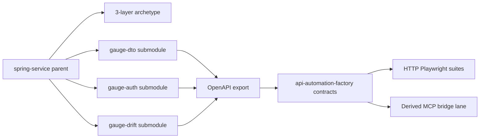

# Spring Submodule Workspace Factory Targets - Plan

## Goal Capsule

- **Objective:** Own a git-submodule Spring workspace under `asub927/spring-service` with a classic 3-layer archetype and three factory-stress gauge services, and hand off digested OpenAPI (+ derived MCP) contracts into `api-automation-factory` so factory-emitted suites execute and a fourth API can onboard without bespoke factory code.
- **Product authority:** This plan owns the Spring workspace shape, gauge-service product intent, and factory contract handoff for those targets. It does not own in-process Spring MCP servers or the factory's core compiler product (see parent factory plan).
- **Open blockers:** None for planning. GitHub remote creation for the three sibling gauge repos is assumed available to the implementer.
- **Surrounding work:** Dual-lane Spring `/mcp` truth source and intentional drift-sibling CI teaching are deferred follow-ons, not active scope.

## Product Contract

### Summary

Make `asub927/spring-service` the multi-service workspace: keep a 3-layer Spring archetype in the parent, pin three sibling gauge remotes as git submodules, export springdoc lockfiles into the factory's `contracts/<service>/` tree, and prove that factory-compiled HTTP suites run against those services while MCP coverage uses the existing OpenAPI→MCP derive/bridge path—so onboarding scales beyond these three targets.

### Problem Frame

The factory's Tier E path assumes real Spring Boot contracts, but today's fixtures are a flat Node demo and public JSONPlaceholder. `spring-service` is an empty scaffold. Without owned 3-layer Spring targets and a repeatable handoff into `contracts/`, factory suites cannot be proven against production-shaped Spring, and each new API risks becoming a one-off integration.

### Key Decisions

- KD1. Workspace lives in `spring-service` — Parent is the submodule superproject, not a new sibling workspace and not inside the factory repo. `(session-settled: user-directed — chosen over sibling workspace repo or factory-internal submodules: reuse the owned empty seed as the workflow root)` Governs R1, R2.
- KD2. Three sibling remotes as submodules — Each gauge is its own GitHub remote pinned under the parent; archetype stays in the parent. `(session-settled: user-directed — chosen over glue-only parent or single-repo multi-module without git submodules: keep true submodule pins while retaining the archetype in spring-service)` Governs R2, R3.
- KD3. Factory stress triad — Services stress DTO/validation richness, Bearer auth + mutations, and intentional OpenAPI gap—not an ecommerce saga mesh. `(session-settled: user-directed — chosen over domain triad or minimal pair: assay the factory's failure modes)` Governs R3, R4.
- KD4. Approach A execute path — Live HTTP suites against Boot apps; MCP lane via derive/bridge; generalize factory dispatch so the next API is manifest-driven. `(session-settled: user-approved — chosen over full Spring /mcp now or contracts-only dry-run: tests must execute and scale)` Governs R5, R6, R7, R8.
- KD5. v1 includes factory handoff — Digested lockfiles + manifests in `api-automation-factory`, not Spring-side only. `(session-settled: user-directed — chosen over Spring-only or full dual-lane CI: factory must consume the targets)` Governs R6, R7.

### How This Work Fits Together

<!-- ce-section: work-relationships -->

This plan owns the **owned Spring experiment targets + contract handoff** slice. The broader factory product remains defined by [`docs/plans/2026-09-04-001-feat-api-automation-factory-plan.md`](docs/plans/2026-09-04-001-feat-api-automation-factory-plan.md). Ideation context: [`docs/ideation/2026-09-07-spring-submodule-workspace-ideation.html`](docs/ideation/2026-09-07-spring-submodule-workspace-ideation.html).

- **Current area:** Spring submodule workspace + stress gauges + factory contract handoff + executable HTTP suites + scalable onboard path
  - **Enables:** later dual-lane Spring `/mcp` truth source (ideation #5)
  - **Enables:** deliberate drift-sibling teaching targets beyond the OpenAPI-gap gauge (ideation #6)
  - **Depends on:** factory lockfile-only OpenAPI ingest and derive-MCP tooling already in `api-automation-factory`
  - **Can proceed independently of:** Spring AI MCP protocol adoption; Petclinic/Eureka stacks
  - **Still to decide (later plans):** in-process `/mcp` shape; SHA↔digest hard gates; mutation-lab `@Tag` export policy

### Actors

- **Factory operator / SDET** — boots the workspace gauges, syncs contracts, runs `factory propose` / Playwright projects, reviews propose PRs.
- **API / MCP service owner (future)** — pattern this workspace establishes for onboarding other Spring APIs without factory core edits.
- **api-automation-factory (system)** — compiles inventory from lockfiles + MCP defs and emits HTTP + MCP suite lanes.

### Requirements

**Workspace and archetype**

- **R1.** `asub927/spring-service` is the git submodule superproject for the Spring experiment workspace.
- **R2.** The parent retains a reusable classic 3-layer archetype (controller → service → repository) with stable `operationId` conventions and without Spring Data REST auto-exposure; gauge services are generated or forked from that archetype.
- **R3.** Three gauge services exist as separate GitHub remotes, each pinned as a git submodule of the parent, covering: (a) rich nested DTOs and validation errors, (b) Bearer auth plus mutating operations suitable for mutation allowlisting, (c) intentional OpenAPI incompleteness that exercises the factory's Spring-missing / MCP coverage-floor behavior.

**Service product shape**

- **R4.** Each gauge is a synchronous Spring Boot app with explicit 3-layer packages, springdoc OpenAPI export, fixed local loopback ports, and no service-discovery/config-server mesh requirement for v1.

**Factory handoff and execution**

- **R5.** Failure is unacceptable when factory-emitted suites cannot execute against these targets, or when onboarding another API requires bespoke factory source changes beyond manifests/support YAML.
- **R6.** Each gauge's springdoc OpenAPI is exported and committed under the factory's per-service contract layout as a lockfile (fetch-at-compile remains out of v1), with MCP tool defs derived via the factory's OpenAPI→MCP-compatible derive path.
- **R7.** Factory-emitted HTTP Playwright suites for the gauges run successfully against the live Boot apps (local and/or CI session).
- **R8.** MCP-lane coverage for these gauges uses derived tools and HTTP bridge metadata so both lanes can be compiled; factory MCP client dispatch must accept new service IDs without hardcoded per-service branches.

### Key Flows

- **F1. Onboard a gauge** — Create/fork from archetype → pin submodule in `spring-service` → boot on assigned port → export OpenAPI → sync lockfile + derived MCP into factory `contracts/<id>/` + support stubs → operator runs factory propose/dry-run and HTTP project.
- **F2. Execute factory suites** — Workspace boots required gauges → factory loads manifests → emits/runs HTTP suites against `baseUrl` → MCP lane runs via derived bridge for the same capabilities (where mapped).
- **F3. Scale to another API** — Operator adds a new serviceId via submodule (or external Spring) + contracts/manifest only; no factory TypeScript edit is required for dispatch.

### Acceptance Examples

- **AE1.** When all three submodules are initialized and booted, each exposes springdoc docs and responds on its loopback port without Eureka/Config. Covers R3, R4.
- **AE2.** When OpenAPI is synced for a gauge, the factory has a lockfile under that service's contract path and derived MCP tools sharing operationId (or documented alias) naming. Covers R6.
- **AE3.** When the operator runs the factory HTTP project for a gauge against the live app, tests execute and pass for the in-scope mapped surface (not merely propose dry-run). Covers R5, R7.
- **AE4.** When a fourth serviceId is added with only contracts/manifest/support YAML (and submodule pin if Spring-owned), factory MCP/HTTP dispatch does not require editing hardcoded service branches. Covers R5, R8.
- **AE5.** When the OpenAPI-gap gauge is compiled, the factory surfaces Spring-missing / coverage-floor behavior rather than dropping MCP capabilities that remain defined. Covers R3, R6.

### Success Criteria

- Factory-emitted HTTP suites for the three gauges execute green against live Boot processes.
- A documented onboard path adds another API without factory core code changes.
- Operators can clone `spring-service`, init submodules, and reach a runnable dual-inventory contract state for all three gauges.

### Scope Boundaries

**In scope**

- Archetype in `spring-service`; three sibling gauge remotes as submodules; springdoc export; factory contract handoff; live HTTP suite execution; generic derive-MCP + dispatch for scale.

**Deferred for later**

- In-process Spring `/mcp` dual-lane truth source (ideation #5).
- Full factory CI matrix replacing Node demo for all Spring gauges.
- SHA↔digest hard gate on propose; `@Tag`-filtered springdoc export policy; ecommerce domain triad.

**Outside this product's identity**

- Building a general Spring microservice platform unrelated to factory experiment targets.
- Replacing the factory's compile-first model with agent-authored suites.

### Dependencies / Assumptions

- Implementer can create the three sibling GitHub remotes under the same owner as `spring-service`.
- Factory continues to require OpenAPI lockfiles (fetch mode disabled in v1).
- Local/CI may boot gauges as JARs or containers; exact mechanism is planning's choice so long as R7 holds.
- Egress allowlisting and auth profiles follow existing factory conventions.

### Outstanding Questions

**Deferred to Planning**

- Exact remote names and submodule paths for the three gauges.
- Port matrix values and boot orchestration (script vs Compose).
- Whether derived MCP for the OpenAPI-gap gauge intentionally exceeds HTTP export, and how mappings/exclusions document that.
- How much of `mcpClient` generalization ships in this work vs a thin factory follow-up IU—must still satisfy R8.

**Resolve Before Planning**

- None.

### Sources / Research

- Ideation: `docs/ideation/2026-09-07-spring-submodule-workspace-ideation.html` (survivors #1–#4; #5–#6 deferred).
- Factory product plan: `docs/plans/2026-09-04-001-feat-api-automation-factory-plan.md` (KTD2 lockfile OpenAPI; dual inventory; propose-per-service).
- Experiment ladder Tier E: `docs/research/experiment-apis-and-inputs.md`.
- Seed: https://github.com/asub927/spring-service (empty scaffold).
- Grounding dossier: `/tmp/compound-engineering-1000/ce-brainstorm/spring-spine-1/grounding.md` (in-thread substitution after scout usage-limit failure).
